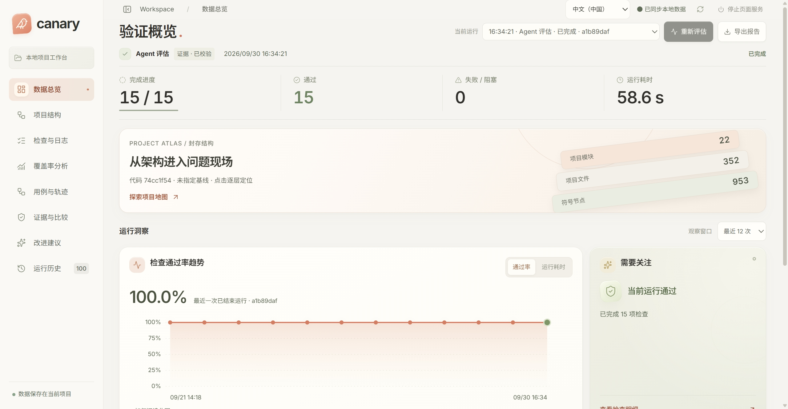

<div align="center">
  
  <h3>看清项目结构，定位失败，验证每一次修复。</h3>
  <p>项目检查 · 交互式架构地图 · 覆盖率分析 · 可追溯证据</p>
  <p><a href="README.md">English</a> · <strong>简体中文</strong></p>
  <p>
    <a href="#快速开始"></a>
    <a href="docs/README.md"></a>
    <a href="docs/roadmap/README.md"></a>
    <a href="https://github.com/EVEDensity/Canary/issues/new/choose"></a>
    <a href="LICENSE"></a>
    <a href="https://nodejs.org/"></a>
    <a href="https://pnpm.io/"></a>
    <a href="https://github.com/EVEDensity/Canary/stargazers"></a>
  </p>
</div>

**Canary 是面向开发者 的项目验证工作台。** 将检查、架构、覆盖率和错误证据放在一起，从一次失败进入具体代码，再追踪修复后的验证结果。通过 CLI、稳定退出码与标准报告接入现有 CI。



## 核心能力

- **统一检查** — 运行构建、类型检查、lint 与测试，导出 JSON、JUnit 和 Markdown 报告。
- **架构地图** — 在二维结构与三维分层视图中探索模块、文件和符号，搜索节点、过滤依赖、查看源码。
- **失败诊断** — 查看问题分类、脱敏日志和源码位置，关联原始失败、修复后重跑与前后比较。
- **覆盖率联动** — 将采集到的行、函数与分支覆盖映射到结构节点，定位未覆盖范围。
- **可信证据** — 用 manifest、内容哈希和运行谱系关联代码版本、检查结果与历史记录。

了解[支持范围](docs/guides/support-matrix.md)。

## 快速开始

准备 **Node.js 24和 Git**，按系统执行一条安装命令：

**Windows / PowerShell**

```powershell
iwr -useb https://raw.githubusercontent.com/EVEDensity/Canary/main/scripts/install/install.ps1 | iex
```

**macOS / Linux**

```bash
curl -fsSL https://raw.githubusercontent.com/EVEDensity/Canary/main/scripts/install/install.sh | bash
```

安装后新开终端，在项目目录或其子目录执行，无需 Canary 配置：

默认使用稳定版，设置 `CANARY_CHANNEL=main` 可使用开发版。通过 `canary upgrade` 升级，`canary upgrade --rollback` 恢复上一版本，`canary installation --json` 查看实际安装提交。

```bash
canary run --ci                  # 自动识别并执行项目检查
canary run --port 4318 --no-open  # 展示交互式报告
```

打开 [localhost:4318](http://127.0.0.1:4318)。也可从任意目录使用 `canary run --ci --project <项目目录>`。

自动识别 Node 项目的构建、类型检查、lint、格式检查与测试脚本，以及 Python、Go、Rust 的标准测试入口。沿用项目声明的包管理器；项目依赖和测试所需服务需已就绪。详见[自动检查](docs/guides/automatic-checks.md)。

## 项目配置

默认自动发现已有检查。自定义命令、超时和覆盖采集见[配置指南](docs/guides/r4-project-checks.md)。产物保存于项目的 `.canary/`，请加入 `.gitignore`。

## 为什么叫 Canary？

名字源于矿井中的金丝雀：它是危险的早期预警信号。Canary 将这一理念带到软件开发——尽早运行检查，让问题清晰可见，并用可追溯证据验证修复。

**早发现，早检测，让修复有据可查。**

## 文档与参与

- [安装与启动](docs/guides/getting-started.md) · [项目检查](docs/guides/r4-project-checks.md)
- [评估与覆盖率](docs/guides/evaluation-and-coverage.md) · [架构与 CI](docs/guides/architecture-ci.md)
- [GitHub Actions](docs/guides/github-actions.md)：绑定提交版本的 PR 摘要、源码标注与证据下载
- [失败复现](docs/guides/reproduction.md)：独立副本、显式执行与原运行证据关联
- [适配器](docs/guides/adapters-and-environment.md) · [目录结构](docs/guides/repository-layout.md)
- [贡献指南](CONTRIBUTING.md) · [翻译贡献](docs/guides/localization.md) · [安全政策](SECURITY.md)

新增语言：`pnpm i18n:add <locale>` 创建草稿，`pnpm i18n:check` 校验翻译契约。审核并合并完整资源后，语言自动出现在界面菜单中。

欢迎提交 Issue、改进文档或贡献代码。下一阶段聚焦 PR 诊断、修复验证与变更验证缺口，详见[路线图](docs/roadmap/README.md)。

## 许可证

[Apache-2.0](LICENSE)。随包字体与图标保留各自许可证声明。
