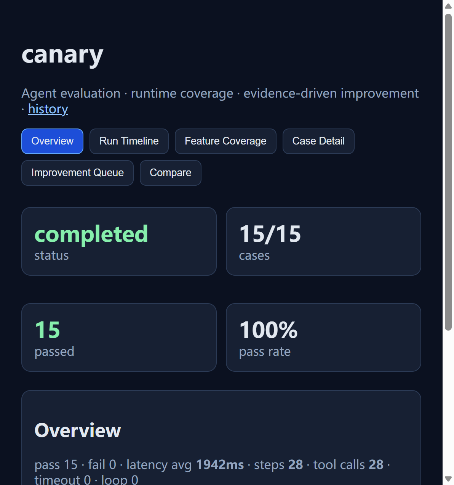

<div align="center">
  
</div>

<div align="center">

<div>
<a href="https://github.com/EVEDensity/Canary/actions/workflows/ci.yml"></a>
<a href="https://github.com/EVEDensity/Canary/releases/latest"></a>


<a href="https://github.com/EVEDensity/Canary/stargazers"></a>
</div>

<br>

<a href="docs/guides/getting-started.md">Getting Started</a> ｜
<a href="docs/current/architecture.md">Architecture</a> ｜
<a href="docs/guides/evaluation-and-coverage.md">Feature Coverage</a> ｜
<a href="docs/guides/improvement.md">Self-Improvement</a> ｜
<a href="docs/guides/ci-and-validation.md">CI</a> ｜
<a href="docs/guides/troubleshooting.md">Troubleshooting</a> ｜
<a href="./SECURITY.md">Security</a> ｜
<a href="https://github.com/EVEDensity/Canary/issues">Issues</a>

</div>

**canary** is a local-first TypeScript Agent testing, coverage, and improvement workspace. It runs your Agent like an end-to-end test — records trajectory, collects V8 source coverage, and turns failures into auditable regression work. The current implementation does **not** edit Agent source. Future controlled evolution is a design target, not an enabled feature.

Canary executes configured cases, records observable events, checks assertions and state, and collects coverage for supported local Node agents. It cannot automatically capture the internal prompts or tool chains of remote black-box agents. Interpret coverage by its status and precision; unavailable numeric placeholders are not measured coverage. Existing suggestions and baseline/candidate reports support manual diagnosis, **not safe automatic admission**. See the [code audit](docs/evidence/code-audit.md) for known comparison and Judge gaps.



## ✨ Key Features

1. 🎯 **V8 Source Coverage** — Live continuous sampling during execution, merged at final; honestly reports `unavailable` when instrumentation is absent.
2. 🪝 **Multi-Adapter** — Agent adapters: `function` (local), `http` (black-box), `mcp` (stdio). MCP tools have separate stdio/HTTP adapters.
3. 🔁 **Repetitions** — `--repetitions N` runs each selected case N times; current comparison does not yet provide reliable trial aggregation or statistical admission.
4. 🛠️ **Mock Environment** — In-memory StateStore with snapshot/restore + MockToolAdapter; no external services required.
5. 🧪 **Extensible Evaluators** — Built-in assertion / state / tool / policy / loop / coverage / coverage-gate evaluators; Judge provider interfaces exist, but CLI/Runner do not yet wire a real semantic Judge.
6. 🏷️ **Replay & Compare** — Replay re-executes recorded case IDs against current configuration, not a frozen historical environment; CLI also provides comparison and reports.
7. 🧠 **Improvement Assistance** — Failure attribution → manually review regression drafts → run a supplied candidate → inspect comparison. No automatic code application or trusted admission controller.
8. 🖼️ **Five-View Web UI** — Live run / Case Detail (assertion diff + source highlight + state diff + preparing state) / Coverage / Compare / Replay.

## 🚀 Quick Start

> Installation scripts create a global command, but the current launcher sets its working directory to the installed checkout. **Running from another project does not yet automatically select that project.** Review remote scripts before executing them. See [installation details](docs/guides/getting-started.md).

Requires Node ≥22 and Git.

**Windows (PowerShell):**

```powershell
iwr -useb https://raw.githubusercontent.com/EVEDensity/Canary/main/install.ps1 | iex
```

**macOS / Linux:**

```bash
curl -fsSL https://raw.githubusercontent.com/EVEDensity/Canary/main/install.sh | bash
```

Already cloned? Run `node scripts/install-global.mjs` from the repo root, or use the manual clone path:

```powershell
git clone https://github.com/EVEDensity/Canary.git "$env:USERPROFILE\Canary"; node "$env:USERPROFILE\Canary\scripts\install-global.mjs"
```

Open a **new terminal**, then:

```bash
canary run
```

Normally runs the selected project's suite: local `canary.config.ts` wins over the installed demo. The CLI prints `runId` and the UI URL **before** cases execute. Headless or `web.enabled: false` does not bind a port: `canary run --headless --no-open`. For another project, pass `--config <path>` (relative paths resolve from the invocation directory); `runs` / `show` / `report` / `replay` / `compare` use the same project root.

Already inside the repo? `node scripts/install-global.mjs` or `pnpm install:global`.

Default suite: 15 deterministic cases under `cases/` against `examples/local-agent` — no API keys needed. Artifacts land under the selected config directory at `.canary/artifacts/<runId>/`.

### Common Commands

```bash
canary run                             # Global command after install:global
canary run --headless --no-open
canary report <runId> --format markdown
canary compare <baselineId> <candidateId>
canary replay <runId> --headless --no-open
canary run --repetitions 3 --tag nightly
```

## 📦 Monorepo Structure

```
Canary/
├── packages/
│   ├── core/           # Domain types + Zod schema + IPC protocol
│   ├── coverage/       # V8 collector + Istanbul fallback + fragments merge
│   ├── evaluators/     # Evaluator suite + attribution engine + LLM Judge
│   ├── adapters/       # Agent: function / http / mcp; separate MCP Tool adapters
│   ├── environment/    # In-memory StateStore + MockTool
│   ├── runner/         # Orchestration · repetitions · cancel · streaming artifacts
│   ├── reporters/      # json · markdown · junit · console
│   ├── improvement/    # Compare · decideSuggestion · regression drafts
│   ├── trace/          # JSONL persistence store
│   └── cli/            # run / runs / show / report / compare / improve / suggest / candidate / replay
├── apps/web/           # Five-view Web UI (SSE)
├── cases/              # smoke / regression / holdout
├── examples/           # local-agent · mcp-agent · http-agent · loop-agent · recovery-agent · improvement-demo
├── docs/               # current / guides / design / roadmap / evidence / research / archive
└── .github/workflows/  # CI · Release
```

## 📋 Adapter & Coverage Matrix

| Target         | Adapter                  | Coverage                                     |
| -------------- | ------------------------ | -------------------------------------------- |
| Local TS Agent | `function`               | V8 lines / branches / functions / statements |
| HTTP Agent     | `http`                   | `unavailable`                                |
| MCP Agent      | `mcp` stdio              | `unavailable`                                |
| MCP Tools      | `mcp-stdio` / `mcp-http` | N/A (tools)                                  |
| Bun            | CLI smoke only           | not claimed                                  |

## ⚠️ Honest Boundaries

`canary` does **not** measure remote black-box reasoning quality, non-Node languages, browser visual agents, or Docker sandboxes. Explicit Judge error, timeout and low-confidence paths can fail, but absent injection currently falls back to a deterministic output-existence stub. **That fallback is not semantic evaluation and must not authorize autonomous changes.**

The runner is **not** a sandbox — it executes your Agent code directly. By default no model API is called outbound.

## 📚 Documentation and Future Work

Start at the [documentation index](docs/README.md). Current behavior, ideal architecture and pending tasks are separate:

- [Actual architecture](docs/current/architecture.md) and [validation baseline](docs/evidence/validation-baseline.md).
- [Ideal bounded Agent loop](docs/design/agent-loop.md) and [soft/hard evolution policy](docs/design/evolution-policy.md).
- [Implementation roadmap](docs/roadmap/README.md): all future tasks remain pending.

## ❤️ Contributing

Issues and Pull Requests are always welcome. For adding new features, please discuss via an Issue first.

```bash
git clone https://github.com/EVEDensity/Canary
cd Canary
pnpm install
pnpm build          # package exports resolve built dist
pnpm check          # format / lint / typecheck / test
pnpm demo:headless  # default 15-case smoke (same as CI)
```

## 🌍 Community & Links

<a href="https://github.com/EVEDensity/Canary/discussions">Discussions</a> ｜
<a href="https://github.com/EVEDensity/Canary/issues">Issue Tracker</a> ｜
<a href="docs/guides/ci-and-validation.md">10-minute Acceptance</a>

## 📄 License

[Apache-2.0](./LICENSE)

—— Like a canary in a coal mine: early signal, precise localization, auditable trail.
