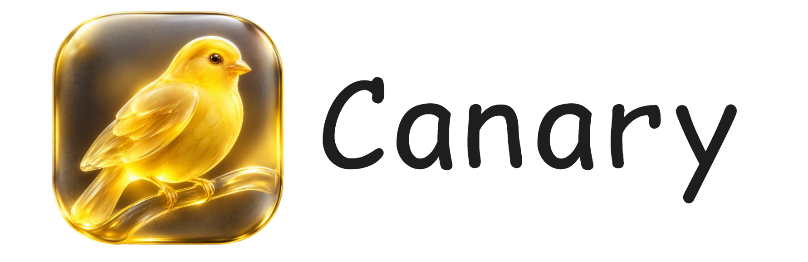
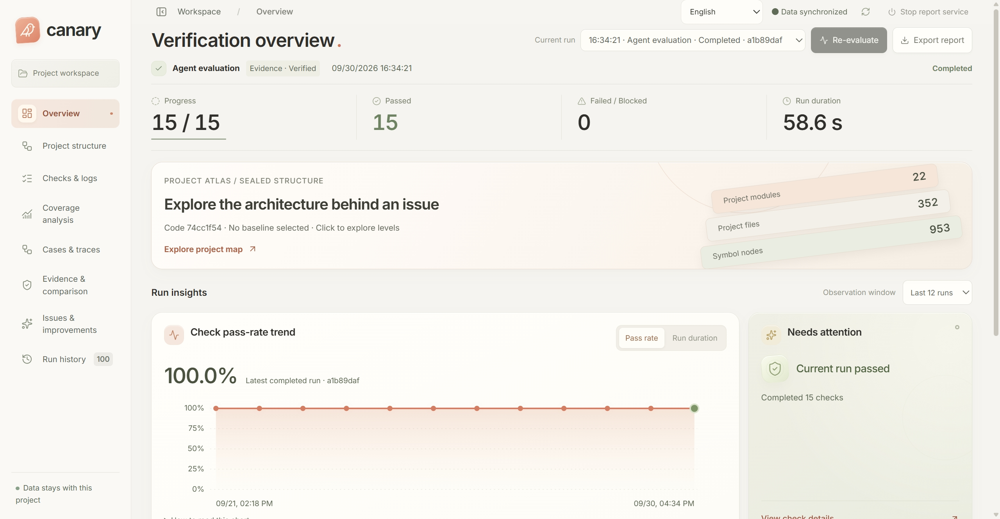

<div align="center">
  
  <h3>Explore your architecture. Diagnose failures. Verify every fix.</h3>
  <p>Project checks · Interactive architecture maps · Coverage analysis · Traceable evidence</p>
  <p><strong>English</strong> · <a href="README.cn.md">简体中文</a></p>
  <p>
    <a href="#quick-start"></a>
    <a href="docs/README.md"></a>
    <a href="docs/roadmap/README.md"></a>
    <a href="https://github.com/EVEDensity/Canary/issues/new/choose"></a>
    <a href="LICENSE"></a>
    <a href="https://nodejs.org/"></a>
    <a href="https://pnpm.io/"></a>
    <a href="https://github.com/EVEDensity/Canary/stargazers"></a>
  </p>
</div>

**Canary is a project verification workspace for developers.** Bring checks, architecture, coverage and error evidence together. Follow a failure into the code, then track verification after a fix. Integrate with existing CI through the CLI, stable exit codes and standard reports.



## Features

- **Unified checks** — Run builds, type checks, lint and tests. Export JSON, JUnit and Markdown reports.
- **Architecture maps** — Explore modules, files and symbols in 2D and layered 3D views. Search nodes, filter dependencies and inspect source.
- **Failure diagnosis** — Inspect categorized issues, redacted logs and source locations. Link original failures to reruns and before/after comparisons.
- **Coverage navigation** — Map collected line, function and branch coverage to structure nodes and locate verification gaps.
- **Traceable evidence** — Connect code versions, check results and execution history through manifests, content hashes and run lineage.

See the [support scope](docs/guides/support-matrix.md).

## Quick start

Use **Node.js 24 and Git**, then run one installation command for your platform:

**Windows / PowerShell**

```powershell
iwr -useb https://raw.githubusercontent.com/EVEDensity/Canary/main/scripts/install/install.ps1 | iex
```

**macOS / Linux**

```bash
curl -fsSL https://raw.githubusercontent.com/EVEDensity/Canary/main/scripts/install/install.sh | bash
```

Open a new terminal and run from your project or any subdirectory. No Canary configuration is required:

```bash
canary run --ci                  # Discover and execute project checks
canary run --port 4318 --no-open  # Open an interactive report
```

Open [localhost:4318](http://127.0.0.1:4318/?lang=en). From another directory, use `canary run --ci --project <directory>`.

Canary discovers Node build, type check, lint, formatting and test scripts, plus standard Python, Go and Rust test entry points. It uses the project's declared package manager; project dependencies and test services must be ready. See [automatic checks](docs/guides/automatic-checks.md).

## Project configuration

Use the [GitHub Action](docs/guides/github-actions.md) for commit-bound PR summaries, source annotations and downloadable evidence.

Automatic discovery uses your existing checks. Configure custom commands, timeouts and coverage using the [configuration guide](docs/guides/r4-project-checks.md). Artifacts belong to the project’s `.canary/` directory; add it to `.gitignore`.

## Why Canary?

The name comes from the canary in the coal mine: an early warning signal. Canary brings that idea to software—run checks early, make failures visible, and verify fixes with traceable evidence.

**Catch problems early. Understand failures. Verify fixes.**

## Documentation & contributing

- [Installation & setup](docs/guides/getting-started.md) · [Project checks](docs/guides/r4-project-checks.md)
- [Evaluation & coverage](docs/guides/evaluation-and-coverage.md) · [Architecture & CI](docs/guides/architecture-ci.md)
- [GitHub Actions](docs/guides/github-actions.md) · [Failure reproduction](docs/guides/reproduction.md)
- [Adapters](docs/guides/adapters-and-environment.md) · [Repository layout](docs/guides/repository-layout.md)
- [Contributing](CONTRIBUTING.md) · [Translations](docs/guides/localization.md) · [Security policy](SECURITY.md)

Add a language with `pnpm i18n:add <locale>` and validate it with `pnpm i18n:check`. Complete, reviewed resources appear automatically in the language menu after merging.

Issues, documentation improvements and code contributions are welcome. Upcoming work focuses on PR diagnosis, repair verification and change verification gaps. See the [roadmap](docs/roadmap/README.md).

## License

[Apache-2.0](LICENSE). Bundled fonts and icons retain their respective license notices.
