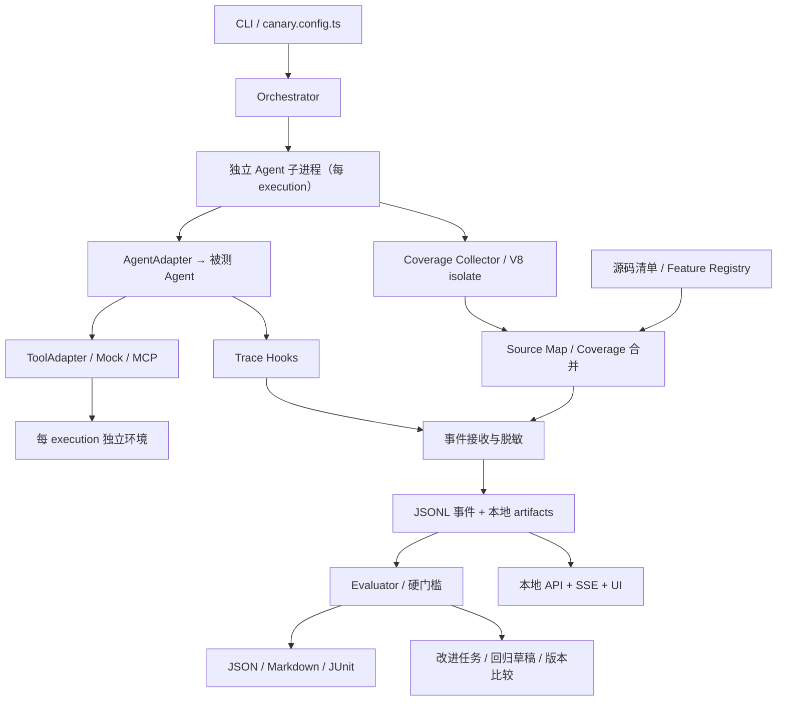

# canary MVP 整体架构设计初始报表

> 版本：0.1-draft｜日期：2026-09-11｜状态：设计基线，尚未实现
> 本文是前序对话的结构化整理、技术核查及新增需求设计，不是逐字聊天记录。
> 行业事实以文末 [S1]–[S12] 为依据；产品指标、接口、CLI 与计划均为 canary 的拟议设计，不代表现有能力。

## 0. 决策摘要与需求追溯

**定位：canary 是 Agent 的本地评测与改进控制台：一键运行 Agent，关联执行轨迹、行为断言与源码覆盖率，并把失败转为可验证的改进任务。**

| 需求 | 架构决策 | 验收位置 |
|---|---|---|
| 项目名称为 canary | 品牌、CLI、文档统一使用小写 canary；npm 包名及 scope 发布前核验，不假定名称可用 | §10、§14 |
| MVP 量化代码覆盖率 | 本地 Node/TypeScript 白盒 Agent 为 P0；提供行、语句、函数、分支覆盖率 | §4、§5 |
| 前端实时展示功能链路覆盖率 | 显式 Feature Registry + 源码范围 + 用例独立采集 + SSE 增量更新 | §5、§6 |
| 帮助 Agent 自进化 | 评测→归因→改进候选→回归与留出集验证→批准/拒绝；默认不改用户源码 | §9 |
| 第一阶段测试对象是 Agent | 测规划、路由、参数、记忆、错误恢复、终止、安全；不绑定订单等业务域 | §3、§8 |
| 一键执行后看到本地页面 | 交互运行自动打开本地 UI；完成后页面保留；CI 使用独立无界面模式 | §6、§10 |
| 对话和研究形成文档 | 本文、对话决策归档及 README 索引；保留需求变更与前版修正 | §1、§15 |

### MVP 的关键取舍

1. **完整白盒覆盖率优先**：先做好一个本地 TS Agent，而不是声称任意远程 Agent 都有源码覆盖率。
2. **UI 属于 P0**：不是以后再加的 Dashboard，第一周开始实现，第三周整合完成。
3. **MCP 是工具协议，不自动等于 Agent 入口协议**：AgentAdapter 和 MCP ToolAdapter 分开。
4. **代码覆盖率、功能触达率、任务成功率分别报告**，不能互相替代。
5. **默认单用例独立子进程、并发 1**；代码正确归因优先于吞吐量。
6. **四周交付一个窄而完整的闭环**：不同时承诺容器集群、浏览器 Agent、分布式 Trace 和自动修复平台。

## 1. 背景与现状分析报告

### 1.1 行业演进与决策含义

从 DeepEval 的评测指标、Phoenix 的 Trace/实验能力、τ-bench 的多轮工具任务和 SWE-bench 的可执行验证可以看出：Agent 评测已不能仅以单轮最终文本为单位，需要把任务、交互过程、环境状态和结果验证联合起来看。[S1–S5]

对 canary 的产品判断：

```text
Dataset → Runner → Agent → Tool / Environment
                    ↓              ↓
                  Trace ← 状态变化与错误
                    ↓
          Evaluator + Coverage → Report → 改进候选
```

| 痛点 | 对 canary 的设计约束 |
|---|---|
| 模型与工具结果不确定 | 保存模型标识、参数、输入、工具版本和运行次数；重复运行而不是把失败重试到成功 |
| 结果正确但过程错误 | 工具参数、禁止操作、状态变化、终止条件必须有独立断言 |
| 死循环或无限等待 | 步数/工具次数/时间/预算限制；协作取消后由父进程终止受管子进程 |
| 沙盒与真实 API 成本 | 默认 Mock 工具、内存环境；真实凭据显式启用；子进程不是安全沙盒 |
| 状态污染与恢复困难 | 每次 execution 独立状态、临时目录与工具实例；finally 清理 |
| Judge 本身不稳定 | 可执行断言优先；Judge 可选，保存评分规则与版本，错误不算通过 |
| Trace 缺失或过多 | 明确观测能力；结构化事件、脱敏、裁剪和外置大附件 |
| 高通过率掩盖测试不足 | 加入 Agent 源码覆盖率和未覆盖功能范围，但不宣称证明模型推理正确 |

### 1.2 项目对照与开源影响力

下表为 2026-09-11 检索到的官方仓库页面展示值，Star 为四舍五入快照而非实时精确统计。Star 不能替代维护、许可证及适配成本评估；本次没有获得所有项目的精确最近提交时间，不据此宣称它们具有相同维护活跃度。

| 项目 | 页面 Star 约值 | 架构与优势 | canary 借鉴 / 不复制 | 来源 |
|---|---:|---|---|---|
| DeepEval | 18.2k | Python 评测框架、测试与指标抽象 | 借鉴 CI 测试体验，不移植全部评分器 | [S1] |
| Phoenix | 11.4k | OTel Trace、数据集、实验、评测 | 借鉴证据关联，MVP 不部署其平台；当前仓库标注 ELv2，不能当成 Apache/MIT 项目直接混用代码 | [S2] |
| Promptfoo | 25.0k | 声明式评测、模型比较、CLI/CI、红队测试 | 借鉴配置和门禁，不声称其不能测试 Agent | [S3] |
| τ-bench | 1.4k | 多轮用户模拟、工具环境、策略与状态验证 | 借鉴重复运行和环境验证，不把其业务题库作为第一版默认对象 | [S4] |
| SWE-bench | 5.8k | Issue、代码仓库、补丁与执行测试 | 借鉴可执行 verifier，不在四周复制完整容器 harness | [S5] |

原始 τ-bench README 已指向 τ³-bench；引用旧结果必须保留模型及数据集时间，不能把 2024 年成绩当作 2026 年模型现状。[S4]

**差异化假设，而非已证实的市场结论**：个人/小团队需要更低部署成本的“Agent 行为评测 + 被测代码覆盖率 + 本地实时 UI”。用首批 3–5 个真实 Agent 的接入反馈验证这个假设，而非仅以 Star 判断需求。

### 1.3 TypeScript、MCP、Zod 与运行时

- TypeScript 用于共享配置、事件、插件及 UI 类型；Zod 用于实际读取配置和 IPC/API 边界的运行时校验，不能只靠编译期类型。[S7]
- MCP 官方 TS SDK 当前主分支说明 v2 为稳定线，对应 2026-07-28 规范，拆分 client/server 包，并支持 Standard Schema；Zod 是可选实现之一，不是 MCP 协议唯一允许的 Schema 库。[S6]
- canary 第一版建议 Node.js 24 LTS 为基线，Node.js 22 为兼容性验证；本次官方列表中 Node.js 20 已标 EOL，因此替换前序“20/22”建议。[S8]
- Vitest 用于 canary 自身测试；被测 Agent 的运行覆盖率由独立 Collector 负责。Vitest 新版的 V8 AST remapping 是其具体实现，不能假定任意自写 V8 转换也有相同精度。[S9]
- Bun 作为后续非覆盖率模式的兼容目标，不承诺 Node V8 Collector 可在 Bun 直接运行。Vitest 官方明确 V8 provider 不适用于 Bun 等非 V8 环境。[S9]

## 2. 产品目标、边界与成功指标

### 2.1 目标用户和第一条用户路径

目标用户：拥有可修改、可本地运行的 TypeScript Agent 源码的个人开发者或 2–5 人团队。

```text
选择 Agent 入口 → 声明功能源码范围 → 加载能力测试集
→ canary run → 浏览器打开 → 查看实时链路覆盖率
→ 点击失败 → 看 Trace、代码行和断言证据
→ 导出改进任务 → 修复后比较 baseline / candidate
```

### 2.2 范围表

| 级别 | 范围 |
|---|---|
| P0，发布必须具备 | 本地 Function Agent、隔离 Runner、Mock 工具、MCP stdio 工具接入、Trace、运行时覆盖率、功能源码范围、实时本地 UI、JSON/Markdown/JUnit、无密钥 Demo、改进建议导出、基线比较 |
| P1，四周有余量才做 | HTTP 黑盒 Adapter、MCP Streamable HTTP、并发进程池、Judge Provider、自动生成待审测试草稿 |
| 明确不纳入 v0.1 | 全语言覆盖率、分布式请求级覆盖率、自动源码修复、模型训练、云端多租户、浏览器视觉、Docker 集群、公开排行榜 |

### 2.3 拟定验收指标（工程目标，不是实测成绩）

- 首次使用：安装前置环境后，10 分钟内运行本地 Demo 并看到页面。
- 实时反馈：普通异步 Agent 下默认 1 秒采集周期，样本产生后至页面更新 P95 ≤ 2 秒；源映射扫描期间必须显示 preparing。
- 覆盖率：四种维度都报告分子/分母；未执行文件进分母；不可采集显示 unavailable 而非 0% 或 100%。
- 归因：A/B 两个隔离用例只命中各自分支；重复执行不凭百分比相加。
- 行为：至少 12 个确定性能力用例，覆盖工具失败、循环、取消、上下文隔离等。
- 改进闭环：一个故障 Agent 基线、一个人工修复候选，同一评测集下可查看差异并拒绝退化。
- 安全：默认不调用外部模型、不开放局域网、不修改被测仓库。

## 3. 被测对象与接口边界

### 3.1 先测 Agent 的能力，而不是把测试对象换成业务 API

Agent 仍然需要具体输入、受控工具和可验证目标，否则无法判断是否完成任务。区别是：默认任务验证 Agent 通用能力，不绑定电商等领域。

默认 Demo：一个最小规划/工具 Agent，接受结构化任务，选择查找、解析和计算工具，处理一次失败，输出带来源标识的结果。提供：

- 确定性测试替身：验证 canary 的采集和故障识别，无外部模型费用，不作为模型能力证明。
- 用户真实 Agent 接入示例：复用同样测试契约，可选显式配置模型；不承诺离线替身成绩代表真实 Agent 水平。

### 3.2 三类观测能力

| 接入方式 | 能测什么 | 不能承诺什么 |
|---|---|---|
| 本地 TS/Node 白盒 | 输出、显式 Trace、工具调用、状态、Agent 源码覆盖率 | 私有模型内部推理和神经网络覆盖率 |
| 远程 HTTP 黑盒 | 请求/响应、总延迟，及对方显式提供的 Trace | 没有服务端插桩就无法获取其源码覆盖率 |
| 受管本地 MCP 工具 | 工具协议、调用参数、错误、Mock 行为 | MCP Server 不是自动可运行的自主 Agent；其工具代码覆盖率不能冒充 Agent 覆盖率 |

AgentAdapter 负责执行用户 Agent；ModelProvider 负责模型调用；ToolAdapter 负责工具/MCP；CoverageProvider 负责受测运行时。四者不混用。用户通过上下文注入的工具调用可被采集；绕过 Hook 的 SDK 调用不能假定自动可见。

## 4. 模块架构与数据流



| 逻辑模块 | 输入→输出 | 关键职责 |
|---|---|---|
| Config / Dataset | TS 配置、JSONL→校验后 TestCase | Schema、标签、版本、文件路径范围 |
| Orchestrator | Case→execution | 生命周期、超时、取消、资源与并发限制 |
| AgentAdapter | 输入+上下文→输出 | 接入一个 Agent，不替用户实现所有 Agent SDK |
| Tools / Environment | 工具请求→结果/状态 | Mock、故障注入、MCP、reset/cleanup |
| Trace | Hook→带序号事件 | callId/spanId、脱敏、截断和关联 |
| Coverage | 源码+V8 数据→coverage artifacts | 固定分母、源映射、增量合并、完整性 |
| Evaluator | Case+Trace+状态+coverage→结果 | 确定性优先；错误与失败分离 |
| Store / Report | 事件+结果→持久化报告 | 原子完成标志、可追溯 artifact |
| Local UI | API/SSE→实时页面 | 状态、矩阵、源码、失败与比较 |
| Improvement | 失败证据+基线→改进任务 | 不在 MVP 自动写源码或更改门槛 |

MVP 采用一个工作区、三个实际构建单元：`packages/core`、`packages/cli`、`apps/web`。上述逻辑模块先做 core 内目录，避免为四周项目创建十多个独立 npm 包。

### execution 生命周期

1. 解析配置、构建带 Source Map 的 Agent、生成源码清单与 hash。
2. 启动本地 UI，创建 runId；每个 case × repetition 分配唯一 executionId。
3. 为 execution 新建子进程、环境、目录；在导入 Agent 前启动覆盖率。
4. 单独标记模块加载/初始化覆盖；初始采样后清空计数窗口，再开始 Agent 任务。
5. 持续接收 Trace、工具事件和 coverage fragments；归并后推送 UI。
6. Agent 完成/失败/取消后 flush；采集最终状态，运行 verifier。
7. finally 关闭受管 MCP 子进程、工具和临时资源；报告 incomplete 不伪装为完整成功。
8. 汇总重复运行与门槛；生成 artifacts；交互页面进入 completed 状态。

## 5. 代码覆盖率：量化、链路归因与实时性

### 5.1 三种覆盖概念必须分开

| 概念 | 定义 | 不代表什么 |
|---|---|---|
| Agent 源码覆盖率 | 被测 Agent 的执行语句/分支/函数/行命中比例 | 不代表任务正确、模型能力或“思维过程覆盖” |
| 功能触达率 | 已观测 feature span / 声明功能数量 | 触达不代表功能内每个分支都测过 |
| canary 自身测试覆盖率 | 框架单测/集成测试覆盖情况 | 不能展示成用户 Agent 的覆盖率 |

四类代码指标均为 `covered / total × 100`。分母为配置选中的可执行源码单元，不能仅统计已加载文件。`total=0` 显示 N/A；缺数据、映射失败、崩溃漏采分别显示原因。

### 5.2 采集路径与版本风险

设计采用 Node Inspector 的 precise coverage：`Profiler.enable → startPreciseCoverage({callCount:true,detailed:true}) → 周期 takePreciseCoverage → 最终 flush → stop`。Node Inspector 提供 V8 协议接入；CDP 明确 take 会重置执行计数，数据粒度为当前 isolate，precise coverage 还会影响优化执行。[S10][S11]

因此：

- 一份 fragment 是采样区间数据，不是永远递增的全量快照；只能合并一次。
- 每次 execution 独占一个受管 isolate；子线程/另起进程无独立采集时标记缺失。
- Collector 不开放远程调试端口，默认内部 Session。
- 所有耗时标记 `instrumented=true`，性能比较须保持插桩设置一致；不宣称零开销。

首周对 **AST-aware V8 转换**进行 PoC；锁定选定库版本，用已知分支真值和 Istanbul 插桩对照验证。可评估 Vitest 所用 AST 转换思路，但不依赖其私有 API，也不把老 `v8-to-istanbul` 默认当作精确真值。[S9]

实现优先级：

1. P0 只支持有 Source Map 的 ESM 编译产物和选定 TS 编译链；编译器、源映射和源码 hash 存入 manifest。
2. 预扫描 include 范围，建立零命中 coverage map，包括未 import 的文件。
3. 按 `sourceHash + file + coverage-unit-location` 合并命中集合；同时保留执行计数用于诊断。
4. 若首周 V8 转换验证不能通过，切换 AST/Istanbul 插桩 Provider 作为完整性优先的 MVP 后备；UI 与数据契约不变。
5. 文件映射不全时显式 partial；strict 模式门槛失败，不能悄悄缩小分母。

离线替代可用 `NODE_V8_COVERAGE` 与 `v8.takeCoverage()` 落盘；后者也会重置计数。这是备选采集路径，不与 Inspector 双开争抢同一会话。[S12]

### 5.3 功能链路如何定义与计算

**Feature Registry 是产品契约，不依赖 LLM 自动猜测功能。** 示例：

```ts
features: [
  { id: 'planning', files: ['src/agent/planner.ts'] },
  { id: 'tool-routing', files: ['src/agent/router.ts'] },
  { id: 'error-recovery', files: ['src/agent/recovery.ts'] },
  { id: 'termination', files: ['src/agent/limits.ts'] },
]
```

实现允许进一步声明源码行区间，后续再支持稳定符号 ID。边界跨过一个语句时，按该语句起点归属，规则固化并测试。文件/区间配置为空或无可执行单元必须告警。

- `U_f`：feature 配置对应的全部可执行覆盖单元。
- `H_e`：一个 execution 的实际命中集合。
- **用例×链路源码覆盖率**：`|H_e ∩ U_f| / |U_f|`。
- **链路全测试集覆盖率**：`|(∪ H_e) ∩ U_f| / |U_f|`。
- 行、语句、函数、分支分别按上述集合口径计算，不能平均各用例百分比。
- 多链路共享同一文件时允许重叠，但全局分母按源码单元去重。
- UI 标注这是“该链路声明源码范围的覆盖率”，不是“span 内精确因果覆盖率”。

可选 `ctx.feature('planning', fn)` 使用 AsyncLocalStorage 关联 Trace，衡量链路触达和顺序；**AsyncLocalStorage 并不能让 V8 计数变成按异步 span 归因**。同一个 Agent 中并发 span 的精确语句归属不属于 v0.1；如果未来需要，采用上下文感知插桩或独占链路实验，而不是相邻全局快照相减。[S11 支撑 isolate 范围；归因限制是据此作出的架构判断]

### 5.4 实时语义与故障处理

- 默认每 1 秒采集一次，并在用例结束时强制 flush；周期可配置，前端显示 sampledAt 和 freshness。
- 更新中的数值标记 provisional；最终 manifest 固定后标记 final。
- 保留最后一次有效 fragment。事件循环被同步代码阻塞时，不保证实时采样；父进程超时后强制停止，报告 stale/partial。
- 每个 fragment 用 `(executionId, processId, isolateId, sequence)` 去重，浏览器重连不会重复累计。
- 同一 sourceHash 下 hit 集合取并集，覆盖百分比不会因重复运行叠加超过 100%。
- 不同源码版本、转换器版本或 include/exclude 配置不直接合并；比较时展示新增/删除代码及分母变化。

### 5.5 门槛建议

首批 Demo 可采用 lines≥80%、functions≥75%、branches≥70%，这些是启动配置，不是行业标准，也不强制所有 Agent 使用同一阈值。关键安全/终止分支要求有专项测试，不能仅靠全局平均值掩盖。

门槛可为 global 或 feature 级别；未覆盖为 0%，不可观测为 unavailable。要求覆盖率的配置在 unavailable/partial 时不能通过。测试数很少时不把三次重复结果解释成统计可靠性保证。

## 6. 本地可视化页面

### 6.1 一键运行体验

```bash
npx canary run
```

交互运行：启动本地服务、绑定 `127.0.0.1`、选择可用端口、打印地址并默认自动打开浏览器。CI 使用 `--no-open --headless`，只产出 artifacts 和退出码。

页面包含 Overview、Run Timeline、Feature Coverage、Case Detail、Improvement Queue 五个视图。实时通道优先使用 SSE；事件包括 `run.started`、`case.started`、`trace.event`、`coverage.updated`、`case.finished`、`run.finished` 和 `run.error`。浏览器重连后用 `lastEventId` 或 run 快照补齐，不重复累计 coverage fragment。

### 6.2 首屏必须能看见

- 通过率、失败率、当前进度、延迟、步骤、工具调用、循环/超时；
- global lines/branches/functions/files；
- 每条 feature 的覆盖率、通过率、期望用例、未覆盖源码位置；
- 当前 Case 的轨迹、断言、状态差异和 coverage evidence；
- provisional/final、partial/unavailable、源码版本和更新时间；
- Replay 命令、导出 JSON/Markdown/JUnit 按钮。

### 6.3 本地 API

```text
GET  /api/runs
GET  /api/runs/:runId
GET  /api/runs/:runId/cases
GET  /api/runs/:runId/coverage
GET  /api/runs/:runId/trajectory/:trajectoryId
GET  /api/runs/:runId/events       # SSE
POST /api/runs/:runId/replay
GET  /api/runs/:runId/report/:format
```

默认不暴露局域网；绑定、CORS、自动打开和结果保留时间均可配置。

## 7. 极简数据结构

```ts
export interface TestCase {
  id: string;
  description?: string;
  input: unknown;
  expectedFeatures?: string[];
  assertions: AssertionSpec[];
  environment?: { state?: Record<string, unknown>; tools?: unknown[] };
  options?: { timeoutMs?: number; maxSteps?: number; repetitions?: number };
}

export interface Trajectory {
  id: string;
  runId: string;
  caseId: string;
  events: TrajectoryEvent[];
  stepCount: number;
  termination: 'completed' | 'timeout' | 'budget_exceeded' | 'error' | 'loop_detected';
  startedAt: string;
  finishedAt?: string;
}

export interface CoverageSummary {
  runId: string;
  sourceHash: string;
  status: 'provisional' | 'final' | 'partial' | 'unavailable';
  lines: CoverageMetric;
  statements: CoverageMetric;
  functions: CoverageMetric;
  branches: CoverageMetric;
  featureChains: FeatureCoverage[];
}

export interface EvalResult {
  runId: string;
  executionId: string;
  caseId: string;
  passed: boolean;
  assertions: AssertionResult[];
  coverage: CoverageSummary;
  failureCategory?: 'wrong_output' | 'wrong_tool' | 'wrong_arguments' | 'loop' | 'timeout' | 'state_mismatch' | 'coverage_below_threshold' | 'runtime_error';
  metrics: { latencyMs: number; steps: number; toolCalls: number; estimatedCostUsd?: number };
}
```

所有跨进程数据先通过 Zod 解析；`unknown` 只表示用户 Agent 的任意输入/输出，不表示内部事件可以跳过校验。Trace 大字段限制大小并脱敏，原文是否保留由配置决定。

## 8. 评测器与质量模型

MVP 评测器：输出存在/匹配、工具名、工具参数、调用顺序、重复/循环、最大步数、状态差异、功能链路覆盖率和运行预算。LLM-as-a-Judge 为可选 evaluator，必须把 judge 错误、超时和低置信度分开，不可默认为通过。

建议报告硬门槛和分项指标，不隐藏关键失败：

```text
硬门槛：state assertions = 100%；policy violations = 0；loops = 0；核心 feature 不得 unavailable
分项：task completion、tool correctness、argument correctness、trajectory efficiency、coverage、latency、cost
```

任务成功率和代码覆盖率不能相互替代；通过但 coverage 低应显示 `behavior_passed_coverage_insufficient`。

## 9. Agent 自进化闭环

### 9.1 定义

canary 的“自进化”是可审计的持续改进系统，而不是默认让 Agent 自己改生产源码：

```text
Agent run → Trace + Eval + Coverage + State
          → Failure attribution
          → ImprovementSuggestion
          → Regression case draft
          → candidate Agent / prompt / tool schema
          → isolated rerun on baseline + candidate + holdout
          → compare → human/CI approval
```

### 9.2 MVP 实现

1. **失败归因**：wrong output/tool/arguments、schema error、unrecovered tool error、loop、timeout、state mismatch、coverage gap、安全违规。
2. **证据链**：建议必须引用失败断言、相关 Trace event、工具 Schema、状态 diff、未覆盖源码位置和历史对比。
3. **改进候选**：生成 Prompt/路由/Tool Schema/恢复策略/Guardrail/测试缺口建议；建议是文本和结构化 patch proposal，不直接写代码。
4. **回归素材**：从失败运行保存脱敏输入、环境快照、工具 Schema、轨迹和期望 feature，生成 `cases/regression/*.ts` 草稿。
5. **对照验证**：同一 baseline、相同确定性工具和相同门槛下运行 candidate；另保留不可参与优化的 holdout 集，防止过拟合测试集。
6. **批准状态**：`proposed → accepted/rejected → verified`；只有 verified 才能进入默认回归集。

```ts
export interface ImprovementSuggestion {
  id: string;
  runId: string;
  caseId: string;
  category: 'prompt' | 'routing' | 'tool_schema' | 'recovery' | 'guardrail' | 'test_gap';
  rationale: string;
  evidence: Array<{ type: 'trace' | 'assertion' | 'coverage' | 'state'; ref: string }>;
  proposedCase?: Partial<TestCase>;
  status: 'proposed' | 'accepted' | 'rejected' | 'verified';
  confidence: number;
}
```

### 9.3 防止“为了得分而退化”

- 测试集拆为 regression 和 holdout；
- 门槛配置、评测器版本和源码 hash 进入结果；
- 只显示代码覆盖率变化，不允许候选通过删除测试或缩小 include 范围来得分；
- 保护安全、终止和错误恢复用例；
- 自动改动放隔离分支并执行 CI，MVP 默认关闭自动提交/合并；
- 外发 LLM Judge 前脱敏，默认全本地存储。

## 10. 开发计划：4 周 MVP

| 周期 | 核心交付物 | 验收 |
|---|---|---|
| Stage 1 / 第 1 周 | monorepo、strict TS、Vitest、Zod；Function Agent Adapter；TestCase/Trajectory/EvalResult；Runner 超时/步数/循环；Trace JSONL；V8 coverage PoC；README Quick Start | 本地确定性 Agent 可运行，拿到真实 coverage manifest 和基础报告 |
| Stage 2 / 第 2 周 | MCP stdio ToolAdapter；Mock Tool/HTTP；内存 State Store、快照恢复；Tool/State/Trajectory 断言；Feature Registry；Source Map/coverage merge | 两个分支可被不同 Case 命中；UI 数据契约可展示 feature coverage |
| Stage 3 / 第 3 周 | 本地 API；SSE；Overview/Timeline/Feature Coverage/Case Detail；JSON/Markdown/JUnit；repetitions、Replay、门槛；GitHub Actions | `canary run` 打开本地页面，运行期间实时变化，CI 失败返回 1 |
| Stage 4 / 第 4 周 | 失败归因；ImprovementSuggestion；回归 Case 草稿；baseline/candidate/holdout 比较；脱敏；Node 22/24 CI、Bun smoke test；README、CONTRIBUTING、SECURITY、CHANGELOG、LICENSE、Issue 模板、v0.1.0 | 新用户 10 分钟内能运行 Demo、定位失败、导出报告和回放；发布 RC 后再打 tag |

### 每周工程门槛

- Week 1：先证明覆盖率 Collector 对已知 `if/else`、函数和异常路径的分子/分母正确。
- Week 2：先证明 execution 隔离和覆盖率 merge，不用并发掩盖状态污染。
- Week 3：先证明浏览器断线重连和最终 flush，不只展示漂亮的模拟进度。
- Week 4：先证明候选改进没有降低 holdout 和安全门槛，再做发布宣传。

## 11. 项目目录初稿

```text
canary/
  packages/
    core/          types, zod schemas, lifecycle
    runner/        orchestration, limits, replay
    adapters/      function, http, mcp
    environment/   mock tools, state, snapshots
    trace/         events, redaction, JSONL store
    coverage/      v8/istanbul providers, manifest, merge
    evaluators/    output, tool, trajectory, state, coverage
    improvement/   attribution, suggestions, regression drafts
    reporters/     console, json, markdown, junit
  apps/
    web/           local server, SSE, dashboard
  examples/
    local-agent/
    mcp-agent/
    loop-agent/
    recovery-agent/
  cases/
    smoke/
    regression/
    holdout/
  docs/
  .github/workflows/
  canary.config.ts
  README.md
  CONTRIBUTING.md
  SECURITY.md
  CHANGELOG.md
  LICENSE
```

建议先用单一 workspace/package 交付，等插件 API 稳定后再拆 npm 包；许可证拟选 Apache-2.0，但发布前核验依赖许可证和 npm 包名可用性。

## 12. 配置与用例示例

```ts
export default defineConfig({
  agent: { adapter: 'function', entry: './src/agent.ts', export: 'runAgent' },
  cases: './cases/**/*.ts',
  runtime: { timeoutMs: 60_000, maxSteps: 20, repetitions: 3 },
  coverage: {
    include: ['src/agent/**/*.ts'],
    exclude: ['**/*.test.ts', '**/node_modules/**'],
    lines: 80, branches: 70, functions: 75,
    featureChains: { planning: 70, toolRouting: 80, errorRecovery: 60 },
  },
  web: { enabled: true, host: '127.0.0.1', open: true },
  reporters: ['console', 'json', 'markdown', 'junit'],
});
```

```ts
export default defineCase({
  id: 'agent-recovers-from-tool-error',
  input: '执行一个需要规划、工具调用和失败恢复的任务。',
  expectedFeatures: ['planning', 'tool-routing', 'error-recovery'],
  assertions: [
    expect.output().exists(),
    expect.trajectory().hasNoLoop(),
    expect.trajectory().maxSteps(12),
    expect.coverage().feature('error-recovery').atLeast(60),
  ],
});
```

## 13. 开源文档、CI 与发布准备

README 首屏只回答：解决什么问题、30 行 Quick Start、页面截图/GIF、支持矩阵、覆盖率语义、不能测什么和安全提示。文档目录应包含：Getting Started、Agent Adapter、MCP、Mock Environment、Feature Coverage、Local UI、CI、Replay、Self-improvement、Troubleshooting、Architecture。

GitHub Actions 至少执行：format/lint、typecheck、canary 自身单测、coverage collector fixture test、build、三类 Demo、Node 22/24 matrix；Bun 只做兼容 smoke test。发布流程固定为 changeset/changelog、打 tag、npm provenance（若包发布平台支持）、生成 artifact 和 release notes。

## 14. 风险与明确限制

| 风险/限制 | 处理 |
|---|---|
| 远程黑盒没有源码 | 显示 coverage unavailable；要求用户部署 canary Coverage SDK 或上传受信 manifest，不伪造白盒数据 |
| V8/Source Map 变动 | 固定 Node、转换器和 fixture；manifest 记录版本/hash；映射失败 strict fail |
| 多进程/Worker 漏采 | MVP 单进程/单 execution；后续建立 fragment 合并协议 |
| 同步死循环阻塞实时 UI | 父进程 watchdog 强杀；标记终止原因，不能等待 SSE 自己恢复 |
| Agent 自进化过拟合 | holdout、门槛不可由候选修改、保留版本对比 |
| 运行数据含敏感信息 | 本地优先、字段脱敏、大小限制、显式外发开关 |
| “覆盖率高”被误读为“Agent 智能高” | UI 同时展示三类指标和说明，不提供单一隐藏总分 |

## 15. 后续路线

```text
v0.1  本地 TS Agent、MCP、Trace、coverage、feature UI、CI、Replay
v0.2  OTel 导出、Phoenix/Langfuse 集成、更多 Judge
v0.3  Docker Sandbox、文件系统/代码 Agent
v0.4  自动生成测试、失败聚类、Prompt/Tool Schema 对照实验
v0.5  历史实验与团队共享 Dashboard
v0.6  浏览器、多 Agent、长任务和断点恢复
v1.0  稳定插件 API、公开数据集和 benchmark
```

## 16. 参考来源（官方/一手）

- [S1] DeepEval Agent metrics / repository: https://github.com/confident-ai/deepeval
- [S2] Arize Phoenix repository and docs: https://github.com/Arize-ai/phoenix
- [S3] Promptfoo repository: https://github.com/promptfoo/promptfoo
- [S4] τ-bench repository and paper: https://github.com/sierra-research/tau-bench ; https://arxiv.org/abs/2406.12045
- [S5] SWE-bench repository and paper: https://github.com/SWE-bench/SWE-bench ; https://arxiv.org/abs/2310.06770
- [S6] Official MCP TypeScript SDK and MCP specification: https://github.com/modelcontextprotocol/typescript-sdk ; https://modelcontextprotocol.io/specification/2025-06-18
- [S7] Zod documentation: https://zod.dev/
- [S8] Node.js release schedule: https://github.com/nodejs/release#release-schedule
- [S9] Vitest coverage guide and V8 AST remapping: https://vitest.dev/guide/coverage.html
- [S10] Node.js Inspector API: https://nodejs.org/api/inspector.html
- [S11] Chrome DevTools Protocol Profiler: https://chromedevtools.github.io/devtools-protocol/tot/Profiler/
- [S12] Node.js V8 module coverage APIs: https://nodejs.org/api/v8.html

## 17. 最终产品表达

> **canary：像端到端测试一样运行 Agent，像代码覆盖率工具一样量化执行路径，把失败轨迹转为可审计的回归和改进。**

第一阶段只需把下面闭环做扎实：

```text
一键运行 → 本地实时页面 → Agent 轨迹 → 功能链路覆盖率
→ 可执行断言 → 失败归因 → 回归草稿 → baseline/holdout 验证
```
