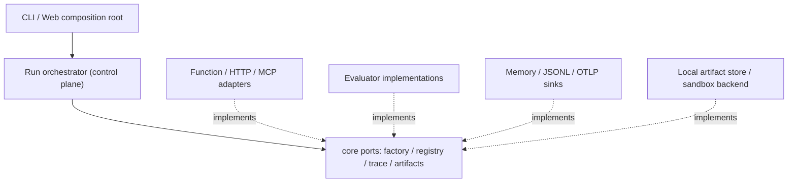

> **历史档案，非当前规范。** 以下正文保留当时结论/数据；当前能力以[源码审计](../../evidence/code-audit.md)为准，后续安排见[任务目录](../../roadmap/README.md)。归档仅新增本提示、修复导航及规范格式。
> 特别修正：原阶段安排已映射到 roadmap；MCP 必须按现代/旧版协议分别验收；未来允许显式授权的受控硬进化，不将当前“不写源码”扩展为永久禁令。原文保留供追溯。

# RFC-002：Canary 演进与下一阶段架构升级工程白皮书

> RFC & System Roadmap · Draft / 待评审 · 2026-09-12
>
> 审阅代码基线：`30f11cf4a303ab8616fb702bad8348bba4955466`。
> 82 / 100 为前次架构评估的启发式分数，不是性能基准、正式认证或本 RFC 已完成实施的证明。
> 本次交付只有本文档；Phase 1 以下代码均为拟实施契约，不表示已经写入源码。

## 阅读约定与决策摘要

- **MUST / 禁止**：合并门禁；不满足即拒绝合并。
- **SHOULD / 建议**：默认执行，例外须记录理由、负责人和补偿措施。
- **现有**、**Phase 1 新增但不接线**、**后续目标**必须区分，不能把目标接口写成产品已支持能力。
- 总原则：**保留本地优先、确定性优先和 Coverage 真实性，以兼容性接缝逐步替换实现，不做整体重写。**
- Phase 1 只调整源码组织和新增类型契约；不修改 Agent 执行、断言语义、持久化字段、SSE/IPC 协议或 CLI 行为。
- Canary 的 improvement loop 继续遵守“不自动修改被测 Agent 源码”的产品边界。本文约束未来人工授权的仓库重构与候选补丁，不默认启用自主代码进化。

---

## 一、现状与瓶颈诊断

### 1.1 现有能力与证据

| 维度          | 当前事实                                                                                                          | 代码证据 / 应保留的性质                                                                                          |
| ------------- | ----------------------------------------------------------------------------------------------------------------- | ---------------------------------------------------------------------------------------------------------------- |
| 领域分离      | 已分离 TestCase、Trajectory、EvalResult                                                                           | `packages/core/src/index.ts`；定义、执行证据、评估结论不应再次混在一个对象中                                     |
| 可插拔边界    | 已有 AgentAdapter、ToolAdapter、Evaluator、CoverageProvider                                                       | `packages/adapters/src/index.ts`、`packages/evaluators/src/index.ts`；问题是端口未统一消费，不是完全没有接口     |
| 确定性断言    | output、tool、state、policy、trajectory、execution、coverage 等断言                                               | `packages/core/src/dsl.ts`、`packages/evaluators/src/index.ts`；保留 DSL 与全部旧断言行为                        |
| Coverage 语义 | 状态含 preparing / provisional / final / partial / unavailable；包含 sourceHash、mapping quality 与 feature chain | 缺少采集时不得伪装成 0% 或 100%；源覆盖率不是答案质量，也不证明功能语义完全正确                                  |
| 生命周期控制  | 已有 child process、IPC 版本/大小校验、AbortSignal、killProcessTree、kill grace                                   | `packages/runner/src/index.ts`；不能再把进程树终止描述为完全缺失                                                 |
| 并发与重复    | 配置已有 runtime.concurrency、repetitions；CLI 测试覆盖进程池并发                                                 | 不得将 Phase 4 写成首次提供并发；目标是统一调度/取消职责并保持行为                                               |
| 评估上下文    | 已有 EvaluationContext、JudgeProvider、JudgeScore.provider                                                        | `packages/evaluators/src/index.ts`；Phase 6 是统一传递路径与职责，而非从零创建 Context                           |
| 环境与 Trace  | 内存 snapshot / restore、JSONL trace、secret redaction                                                            | `packages/environment/src/index.ts`、`packages/trace/src/index.ts`；状态重置不等于安全隔离，脱敏不等于防泄漏保证 |
| 工程出口      | CLI、本地 UI、JSON/Markdown/JUnit、Replay/Compare、改进建议流程                                                   | `packages/reporters/src/index.ts`、`packages/cli/src/index.ts`、`apps/web/src/index.ts`                          |

**对前次 82 分报告的纠偏：**Runner 已实现进程树终止并支持执行取消；已有并发执行测试；已有 EvaluationContext；Judge 已记录 provider。后续任务应补齐覆盖范围、契约一致性和验证，不重复实现这些能力。另外，当前 MCP HTTP 示例/测试明确是 JSON-RPC 子集，不可据此声称完整支持所有 MCP Streamable HTTP 行为。

### 1.2 官方标杆对比及适用边界

资料核验日为 **2026-09-12**。官方 GitHub API 显示以下四仓库均未归档；维护信号是 `pushed_at`，不是稳定版本发布日期，也不代表每次推送都是有效功能变更。本文不以 star 数决定设计正确性。[S1–S4]

| 标杆       | 维护快照（UTC）     | 官方架构实践                                                                               | Canary 采用 / 不采用                                                                          |
| ---------- | ------------------- | ------------------------------------------------------------------------------------------ | --------------------------------------------------------------------------------------------- |
| DeepEval   | 2026-09-08 07:08:59 | Test cases、metrics、datasets 和评估执行；支持组件级评估 [S1]                              | 采用评估器与数据集解耦、结构化结果；不把所有规则替换为 LLM Judge                              |
| Inspect AI | 2026-09-11 19:12:50 | Task 组合 dataset / solver / scorer，Sandbox 单独抽象，支持容器配置资源限制 [S2]           | 采用任务/执行/评分分离与 sandbox capability；不照搬 Python 类型系统或强制所有本地测试使用容器 |
| Phoenix    | 2026-09-12 04:31:55 | 基于 OpenTelemetry 的 tracing，结合 evaluation、datasets/experiments 和 OpenInference [S3] | 采用 span 因果层级、评估关联、可选导出；不把外部观测平台变成运行前提                          |
| Langfuse   | 2026-09-12 14:11:59 | Trace、评估及实验能力；支持 OTLP 接入和异步批量发送 [S4]                                   | 采用异步 exporter、trace/span 关联；不默认上传 prompt、源码或凭据                             |

这些项目不是完全同类：DeepEval/Inspect 更接近评测执行框架，Phoenix/Langfuse 更接近观测与评估平台。Canary 应组合借鉴不同边界，不能以“别人有云控制台”推导本项目必须引入数据库、队列或云服务。

**差异化保留：**Canary 的 V8 源码覆盖率 + feature chain + 本地 Agent 调试闭环，与最终答案评估互补。不要把 Coverage 变成一个必须在线计算的 Judge 分数。

### 1.3 瓶颈一：生命周期隔离没有构成安全边界

当前子进程有超时、退出和进程树控制，但通常仍拥有宿主用户的文件、网络与环境变量权限。`MemoryStateStore.restore()` 只能恢复它管理的内存状态，不能回滚外部文件、HTTP 写操作或 MCP Server 的远端状态。

风险来自不可信 Agent、工具代码、返回内容或补丁对宿主的影响：读凭据、越权写文件、外联、后代进程遗留、无限输出和资源耗尽。**trusted-local 即使内部使用子进程，也仍是 trusted-local。**

改造重点：明确威胁模型、能力声明和 fail-closed 行为；统一现有进程生命周期控制；需要强限制时使用真正能施加限制的后端，不能只增加一个配置枚举。

### 1.4 瓶颈二：Runner 编排与具体执行混杂

当前 Runner 直接引用 coverage 汇总、evaluateAgent / attributeFailure、HTTP/MCP 调用，并在同文件生成子进程执行脚本。测试替换点不足，增加工具协议或 evaluator 容易牵动整个编排入口。

现有 CLI/Web 还承担部分 RunStore、artifact 和报告职责。不能把所有这些职责再次搬进 Runner：控制面应管理执行计划、状态转换、取消、结果提交；适配层应负责进程、协议、覆盖采集和存储 IO。

目标依赖方向：`composition root → orchestrator → core ports ← concrete adapters`。TypeScript interface 存在但 Runner 仍直接调用具体实现，不算完成 Ports & Adapters。

### 1.5 瓶颈三：类型集中、事件开放但语义不足

`core/src/index.ts` 同时包含 configuration、领域模型、provider 契约、FeatureRegistry 和运行时导出。问题主要是职责密度和变化耦合，不能只按文件行数判断质量。

`TrajectoryEvent` 当前只有 type、timestamp 和开放字段，缺少强制的执行关联及 Span 生命周期。扁平数组可以是良好的存储格式，**无需为了层级关系改成嵌套 JSON 树**；应新增稳定身份、parent/link 和开始结束语义，使并行工具调用与嵌套 Agent 可表达。

同时应注意：

- `EvalResult` 当前同时允许 trajectoryId 与内联 trajectory；不能在 Phase 1 删除任何一项。
- `EvalResult.coverage` 必填且有 unavailable 状态，是既有兼容契约，不应随意变成可选。
- `AssertionSpec` 的自定义字符串分支、`input: unknown`、自定义 failureCategory 是扩展面；Phase 1 不能通过“更严格类型”使旧消费者编译失败。
- TestCase 中 predicate/schema 可以是可执行对象，不能假设任意 TestCase 都可直接 JSON 序列化。
- JsonlTraceStore 使用同步 IO；后续异步化必须同时解决背压、flush 和失败语义，而非只把返回值换成 Promise。

---

## 二、核心领域模型与架构改造设计

### 2.1 决策 D1：Experiment → Run → CaseExecution

三级抽象是新领域契约，不在 Phase 1 替换既有 RunSnapshot 或 run.json。

```text
Experiment（评估问题与版本上下文）
  └── Run（一次调度与比较角色）
       └── CaseExecution（一个 case 的一次 repetition / attempt）
            ├── Trajectory / trace spans
            ├── EvalResult 或 EvaluationOutcome[]
            └── ArtifactRef[]
```

关系与不变量：

1. Experiment 可聚合多个 baseline/candidate run；本地 ad-hoc run 允许没有 experimentId。
2. 既有 runId 保持身份不变；新 `CaseExecution.id` 对应既有 executionId，不重新生成第二套 ID。
3. `(runId, caseId, repetition, attempt)` 唯一；repetition 与 attempt 从 1 开始，二者不能混同。重试是未来能力，Phase 1 不改变重试策略。
4. 执行状态、执行终止原因、评估是否通过分离。Agent 正常返回不代表断言通过。
5. 运行配置、case 集合和可取得的 agent/dataset 版本应绑定 digest；未取得的模型 seed/version 明示 unknown，不伪造可复现性。
6. 历史读取兼容层以后在读取时投影新模型；禁止静默覆写旧 artifact。

**Phase 1 拟新增的类型草案：**

```ts
// domain/artifact.ts
export interface ArtifactRef {
  schemaVersion: "1";
  id: string;
  runId: string;
  kind: "trajectory" | "evaluation" | "coverage" | "report" | "other";
  uri: string; // 不透明逻辑地址；不是允许任意读取宿主路径的授权
  mediaType: string;
  contentHash: { algorithm: "sha256"; value: string };
  byteLength: number;
}

// domain/experiment.ts
import type { ArtifactRef } from "./artifact.js";
import type { ExecutionTermination } from "./execution.js";
import type { FailureCategory } from "./failure.js";

export interface Experiment {
  schemaVersion: "1";
  id: string;
  name: string;
  createdAt: string;
  dataset?: { id: string; version: string; digest: string };
  agentRevision?: string;
  metadata?: Record<string, unknown>;
}

type RunIdentity = {
  schemaVersion: "1";
  id: string;
  experimentId?: string;
  role: "adhoc" | "baseline" | "candidate";
  replayOf?: string; // replay 是来源关系，不与 baseline/candidate 角色互斥
  configDigest: string;
  caseSetDigest: string;
  createdAt: string;
};

export type Run = RunIdentity &
  (
    | { status: "queued" }
    | { status: "running"; startedAt: string }
    | {
        status: "completed" | "failed" | "cancelled";
        startedAt?: string;
        finishedAt: string;
      }
  );

type CaseExecutionIdentity = {
  schemaVersion: "1";
  id: string; // 与既有 executionId 一致
  runId: string;
  caseId: string;
  repetition: number;
  repetitionTotal: number;
  attempt: number;
};

export type CaseExecution = CaseExecutionIdentity &
  (
    | { status: "queued" }
    | { status: "running"; startedAt: string }
    | {
        status: "finished";
        startedAt?: string;
        finishedAt: string;
        termination: ExecutionTermination;
        failureCategory?: FailureCategory;
        trajectoryRef?: ArtifactRef;
        resultRefs: ArtifactRef[];
      }
  );
```

这些类型不自动构成运行时校验。Phase 1 的类型测试验证字段与赋值；未来首次持久化前，必须加入版本化 decoder，校验 ID 关联、整数上下界、时间顺序和状态转换。`startedAt?` 允许未真正启动便被取消，不能为了填字段捏造启动时间。

**ArtifactRef 约定：**引用描述的是已封存 artifact。活动 JSONL 流使用内部 handle，flush/finalize 后才能生成 hash/byteLength；不得一边 append 一边宣称同一个 contentHash 有效。存储层处理路径归属、权限、原子提交与完整性校验，禁止将 `uri` 直接交给任意文件读取器。

### 2.2 决策 D2：标准错误分类只增不破坏

```ts
// domain/failure.ts
export type FailureCategory =
  // 保留现有 FailureKind 的全部拼写
  | "wrong_output"
  | "wrong_tool"
  | "wrong_arguments"
  | "schema_error"
  | "unrecovered_error"
  | "loop"
  | "timeout"
  | "cancelled"
  | "state_mismatch"
  | "coverage_gap"
  | "policy_violation"
  | "runtime_error"
  | "assertion_failed"
  // 既有 gate 分类及后续显式基础设施分类
  | "coverage_below_threshold"
  | "coverage_unavailable"
  | "budget_exceeded"
  | "tool_unavailable"
  | "judge_error"
  | "sandbox_violation"
  | "artifact_error"
  | "unknown";
```

- Phase 1 **保留** `EvalResult.failureCategory?: string` 和 `@canary/evaluators.FailureKind` 原定义，不直接替换为封闭枚举。
- 新 CaseExecution 可使用规范类别；旧自定义分类将来通过 `{ category: "unknown", rawCategory }` 显式保留。
- termination 的 `loop_detected` 与归因的 `loop` 属于不同语义层；不可全仓字符串替换。
- timeout / cancelled / judge error 不得伪装成模型回答错误，基础设施失败应有独立诊断。

### 2.3 决策 D3：规范化 Trace 与 Span

**Phase 1：**原样迁移 Trajectory / TrajectoryEvent，不加必填字段。

**Phase 2：**新增版本化的规范结构和显式 normalizeLegacyTrajectory；新旧并存，默认老消费者仍收到原结构。以下为目标草案，不与旧接口重名：

```ts
interface SpanContext {
  traceId: string; // 32 位小写 hex，非全零
  spanId: string; // 16 位小写 hex，非全零
  parentSpanId?: string;
}

interface NormalizedTraceEvent extends SpanContext {
  schemaVersion: "2";
  eventId: string;
  runId: string;
  executionId: string;
  caseId: string;
  sequence: number;
  timestamp: string; // UTC RFC3339
  type: string;
  attributes: Record<string, unknown>;
}

interface TraceSpan extends SpanContext {
  name: string;
  kind: "agent" | "model" | "tool" | "retrieval" | "evaluation" | "internal";
  startedAt: string;
  endedAt?: string;
  status: "running" | "ok" | "error" | "cancelled";
  links?: Array<{ traceId: string; spanId: string }>;
  attributes: Record<string, unknown>;
}

interface NormalizedTrajectory {
  schemaVersion: "2";
  id: string;
  runId: string;
  executionId: string;
  caseId: string;
  traceId: string;
  rootSpanId: string;
  spans: TraceSpan[];
  events: NormalizedTraceEvent[];
  completeness: "complete" | "partial";
}
```

设计约束：

- 保留 flat events/spans 存储，通过引用构图；tool call 与 result 共享 operation/span 身份，支持同名并发工具调用。
- OTel TraceId/SpanId 长度参照官方规范 [S5]。不能直接把带 `run_` 前缀的 UUID 当成 traceId。
- 一个 execution 默认一个根 trace；远端 Agent 支持传播时使用 traceparent/tracestate，不能根据本地 HTTP 请求 span 虚构远端内部轨迹。
- root 无 parent；child 必须属于相同 trace；跨 trace 因果用 link。序号由 execution 的聚合写入点分配，只承诺本地接收顺序，不声称分布式全序。
- 仅有 ID 不等于完整 OTel 兼容；开始/结束时间、span status、context propagation、attribute 类型转换及 exporter 才是 Phase 7 验收内容。
- legacy normalization 只能生成带 `synthetic/legacy` 标记的根关联；不能推测并不存在的精确工具耗时。原始事件保留。
- JSON 自定义事件保持 namespaced 扩展能力；运行时 schema 对标准事件校验必须字段，未知扩展字段不静默丢弃。
- 内容必须在进入本地/远端持久化前经过共同 redaction policy。循环对象、BigInt、超大字符串与附件引用需定义 codec 和大小上限。

### 2.4 决策 D4：Runner 使用端口，组合根选择实现



**Phase 1 类型契约，不接入 Runner：**

```ts
// ports/trace-sink.ts
import type { TrajectoryEvent } from "../domain/trajectory.js";

export interface TraceSink<TEvent extends TrajectoryEvent = TrajectoryEvent> {
  write(event: TEvent): Promise<void>;
  flush(): Promise<void>;
  close(): Promise<void>;
}
```

`write` 的完成代表事件进入有界队列或已写入，不承诺 fsync；`flush` 等待此前已接受事件写入，失败必须可见；是否具备崩溃持久性由具体后端能力声明。`close` 先 flush，再释放资源且幂等；close 后 write 拒绝。队列满默认背压；若某后端允许丢弃，必须记录 dropped count 并标记 partial，不能默默让“未观察到 policy violation”变成通过。

**Phase 3–4 目标端口：**

```ts
interface AgentAdapterFactory {
  create(config: CanaryConfig["agent"]): Promise<AgentAdapter>;
}

interface EvaluatorDescriptor {
  id: string;
  version: string;
  deterministic: boolean;
  requiredEvidence: ReadonlyArray<"output" | "trajectory" | "state" | "coverage">;
}

interface EvaluatorRegistry {
  register(descriptor: EvaluatorDescriptor, evaluator: Evaluator): void;
  resolve(id: string): Evaluator | undefined;
  list(): readonly EvaluatorDescriptor[];
}

interface ArtifactStore {
  put(input: { runId: string; kind: ArtifactRef["kind"]; mediaType: string; data: Uint8Array }): Promise<ArtifactRef>;
  get(ref: ArtifactRef): Promise<Uint8Array>;
  close(): Promise<void>;
}

interface RunnerPorts {
  adapters: AgentAdapterFactory;
  evaluators: EvaluatorRegistry;
  trace: TraceSink;
  artifacts: ArtifactStore;
}
```

约束与接线方式：

- core ports 不得 import runner、adapters、evaluators 的运行时实现，不得依赖 fs、child_process、OTel SDK 或 provider SDK。
- Phase 1 的 AgentAdapter / Evaluator 保持当前签名，`AgentContext.emit(event: unknown)` 不顺手收紧。
- 如需强制 close/cancel/capabilities，Phase 4 新增 ManagedAgentAdapter 或 wrapper，不把新必填方法加到旧 AgentAdapter。
- Factory 的旧 agent config 先保持不变；支持新的 agent kind 或 sandbox 配置必须经过后续版本化配置评审，不在 Phase 1 扩枚举。
- EvaluatorRegistry 重复 ID、descriptor/evaluator ID 不一致、未知选择项应在执行前失败；记录版本与 evidence requirements。
- Phase 1 只声明接口，Phase 3 才实现注册、解析和注入；新增某 assertion 类型仍可能需要 AssertionHandler 分发。Registry 本身不自动解决中央 switch 的扩展问题。
- Trace sink 与 artifact store 所有权由 run scope 明确：per-run sink 仅由 run owner close，不能由单个并发 case 关闭共享 sink。
- 后续把 coverage factory、Clock、IdGenerator、sandbox backend 作为独立端口；不要为 Phase 1 引入服务容器或依赖注入框架。
- 本地必需 artifact 写入失败必须使 run 可见失败/不完整；外部可选 exporter 失败默认只产生诊断，不丢失已完成本地结果。两类失败策略不能混为一谈。

### 2.5 决策 D5：显式安全执行模式

以下是 **Phase 5 目标**，不是 Phase 1 可用配置：

```ts
type ExecutionMode = "trusted-local" | "isolated-process" | "container";

interface SandboxPolicy {
  mode: ExecutionMode;
  filesystem?: {
    access: "none" | "workspace-readonly" | "workspace-readwrite";
    allowedPaths?: string[];
  };
  network?: { access: "none" | "allowlist" | "unrestricted"; allowedHosts?: string[] };
  envAllowlist?: string[];
  resources?: {
    timeoutMs?: number;
    maxMemoryMb?: number;
    maxCpuSeconds?: number;
    maxProcesses?: number;
    maxOutputBytes?: number;
  };
}
```

| 模式             | 必须声明的保证                                                                             | 不保证 / 不允许冒充的能力                                                     |
| ---------------- | ------------------------------------------------------------------------------------------ | ----------------------------------------------------------------------------- |
| trusted-local    | 明示运行可信代码；可以保留已有子进程/超时控制                                              | 不承诺文件、网络、凭据隔离；不适合不可信上传代码                              |
| isolated-process | 独立工作目录、明确 env 继承策略、退出收集、取消/超时升级、整树清理；资源限制以平台能力为准 | 单靠 child process 不是安全沙盒；OS 权限不变时仍可能访问宿主资源              |
| container        | 在后端确实支持且验证时施加 non-root、只读根目录、受限 mounts、网络策略与 CPU/内存/PID 限额 | 容器不等于绝对隔离；不覆盖内核逃逸，不能给容器挂宿主 Docker socket 或全盘凭据 |

执行请求若要求 deny network / hard memory limit，而后端无法强制执行，必须在启动前拒绝；不得静默降级到 trusted-local。资源值只是请求，不是证明，报告应记录 effective policy 和 unsupported capabilities。

MCP 生命周期专项：复用并审计现有 killProcessTree；覆盖 MCP server 后代、异常退出、stdio framing、stderr 上限、pending RPC 统一拒绝、超时后迟到消息、取消竞态、SIGTERM → grace → SIGKILL 与 Windows 清理结果。stdout 协议和 stderr 日志分离。HTTP 客户端 abort 不代表远端 Agent 已终止，须通过能力声明及服务端取消协议区分。

### 2.6 决策 D6：Evaluation Context、Metric、Gate 的职责

Phase 6 演进现有 EvaluationContext：统一 testCase、execution、output、trajectory/ref、state、coverage 与 evaluator provenance；旧 `evaluate({ assertions, trajectory, output, context })` 经兼容 wrapper 继续可用。

- **Assertion**：确定性事实判断，保留 evidence、expected/actual、pass/fail/error/insufficient-evidence。
- **Metric**：数值或分类测量，携带 unit、方向、样本数、有效性；不能只给一个脱离单位的 score。
- **Gate**：依版本化策略汇总 assertions/metrics，决定准入；基础设施失败及关键安全检查不允许被高平均分抵消。
- **Judge**：非确定性证据来源；保留现有 provider，补充 model、rubricVersion、promptHash、usage、latency 和错误/不确定状态。模型无法提供固定版本/seed 时如实记录。

新结果通过版本化 sidecar 或显式 opt-in 提供，旧 EvalResult/assertions/report JSON 不改。对于缺失必要 Trace 的 tool/policy evaluator，应返回 insufficient evidence 并按策略阻断，而不是“零条违规事件即安全”；这一行为调整属于 Phase 6，不能偷偷放进 Phase 1。

### 2.7 决策 D7：OpenTelemetry 与生态适配

- Phase 7 独立可选 exporter 包；core 无 OTel runtime 依赖。
- 以 OTLP transport、标准 span context 为公共层，Phoenix/OpenInference 与 Langfuse 映射作为独立 profile。[S3–S5]
- 保留 `canary.run.id`、`canary.case.id`、`canary.execution.id`、evaluator ID/version；具体属性名在实施时锁定 schema 版本。
- 普通 OTel span 接收成功不意味着平台原生 evaluation/score UI 已接通；分别测试 trace ingestion 和 evaluation association，必要时采用平台专用 API。
- GenAI semantic conventions 存在版本演进，不能在 core 硬编码未经版本管理的映射。
- 默认不开启外发；显式授权 endpoint 和数据策略后才上传；exporter 有界队列、超时、退避和 shutdown flush deadline，不阻塞进程退出。

---

## 三、7 阶段递进式落地路线图

每个 Phase 可拆成多个小 PR；表内为进入/退出条件而非固定日历承诺。Phase 1 是后续基础，不提前承诺分布式调度或完整容器后端。

| 阶段                                | 交付与范围                                                                                                  | 验收门禁                                                                                           | 回退 / 兼容策略                                                                         |
| ----------------------------------- | ----------------------------------------------------------------------------------------------------------- | -------------------------------------------------------------------------------------------------- | --------------------------------------------------------------------------------------- |
| Phase 1：Core 类型拆分与 Experiment | domain / ports / config；原导出兼容门面；新增 Experiment/Run/CaseExecution/ArtifactRef/FailureCategory 类型 | API 双向赋值、runtime export identity、DSL/JSON golden、全量 build/typecheck/test                  | 纯移动可单独 revert；不生成新格式 artifact                                              |
| Phase 2：Trace Schema 与异步 Sink   | NormalizedTrajectory v2、legacy reader、Memory/JSONL sink、有界队列/flush/redaction                         | 同名并发工具可区分；JSONL 不破行；顺序与背压可测；截断尾行恢复须标 partial；旧 Replay 继续工作     | 旧 TraceBuffer/JsonlTraceStore API 保留；新 API 默认 opt-in，不把同步 append 偷换成异步 |
| Phase 3：Evaluator Registry         | descriptor/version、唯一 ID、注册/解析；现有 deterministic evaluator 经 wrapper 注册                        | 测试 evaluator 无需改 Runner 核心；缺 evidence、未知 ID、异常与超时有结果；旧导出兼容              | 显式 legacy dispatcher 适配；不同时改变断言语义                                         |
| Phase 4：Runner Ports               | 接线 factory/registry/sink/store，组合根提供默认实现；拆分 child script 与编排职责                          | fake ports 测试不依赖真实 fs/MCP；真实集成测试仍通过；保持并发/重复/取消顺序及资源所有权           | 原 run API 委托默认 ports；按子边界逐项切换，禁止长驻双执行路径                         |
| Phase 5：安全执行与 MCP             | 模式/capabilities、effective policy；复用整树清理；MCP lifecycle；至少一个受限后端验证                      | Windows/Linux 生命周期测试；被拒绝文件/网络访问；超限/输出洪泛；无后代泄漏；不支持策略 fail closed | 不得把失败的 container 请求降级为 trusted-local；可撤回新后端但保持显式拒绝             |
| Phase 6：Context/Metric/Gate        | 统一上下文、版本化评价结果、缺证据语义、Judge provenance、统计聚合职责                                      | 原 DSL 兼容；新 numeric metric；hard gate 不被均分抵消；Judge timeout/uncertain 不被计为 pass      | 旧报告保持；新结果 sidecar 可关闭；策略变更需单独评审                                   |
| Phase 7：OTel 与 Phoenix/Langfuse   | exporter + profiles、上下文传播、trace/evaluation 关联                                                      | 本地 golden → OTLP fake receiver；opt-in 实际平台联调；断网/限流/退出可测；默认无外发              | 禁用 exporter 不影响本地评测；保留诊断，禁止自动上传补偿                                |

### 3.1 Phase 1 的第一步：先建立可验证的机械拆分边界

**目标不是立即接入 Experiment 或 Trace v2，而是让旧消费者无法感知这次拆分。**

采用两个可单独审查的小补丁：

- **P1-A：兼容性基线 + 原样迁移。**先冻结根导出、DSL、Reporter golden；只移动旧声明与 FeatureRegistry/defineConfig 原实现，保留 schema 与 DSL 的算法。
- **P1-B：追加类型，不接线。**新增 Experiment/Run/CaseExecution/ArtifactRef/FailureCategory 与端口草案；确认新增类型不产生运行时代码或影响旧对象赋值。

**推荐目录：**

```text
packages/core/src/
├── index.ts                        # 兼容门面，只做显式 re-export
├── dsl.ts                          # 原实现；仅改内部 type import
├── schema.ts                       # 原实现原位保留，含 IPC/replay/report 边界
├── domain/
│   ├── testcase.ts                 # TestCase/AssertionSpec/SchemaLike/OutputPredicate
│   ├── trajectory.ts               # 旧 Trajectory/TrajectoryEvent 原样迁移
│   ├── execution.ts                # ExecutionTermination
│   ├── evaluation.ts               # 旧 EvalResult，所有字段与可选性不变
│   ├── experiment.ts               # 新 Experiment/Run/CaseExecution
│   ├── artifact.ts                 # 新 ArtifactRef
│   ├── failure.ts                  # 新 FailureCategory，不收紧旧字段
│   ├── state.ts                    # StateDiff
│   ├── source.ts                   # SourcePosition/SourceRange/SourceLocation
│   ├── coverage.ts                 # Coverage 家族类型
│   ├── feature.ts                  # FeatureDefinition/FeatureCoverage/FeatureRegistry
│   └── events.ts                   # CANONICAL_SSE_EVENTS/CanonicalSseEvent
├── ports/
│   ├── adapter.ts                  # AdapterKind 家族 + 兼容 AgentAdapter 等契约
│   ├── evaluator.ts                # 兼容 Evaluator/Context/Judge 契约
│   ├── trace-sink.ts               # 新泛型 TraceSink，仅类型
│   ├── model-provider.ts           # 已有 ModelProvider/ModelCompletion/Kind
│   └── coverage-provider.ts        # 已有 CoverageProvider
└── config/
    ├── types.ts                    # CanaryConfig/CanaryToolsConfig/CanaryModelConfig
    ├── define-config.ts            # defineConfig 原实现
    └── schema.ts                   # 仅重导出 config schema/parser，不移动混合 schema.ts
```

**为什么 schema.ts 暂不整体搬迁：**当前该文件还含 IPC、RunSnapshot、Replay 等校验；把它全部搬进 config 会制造错误归属。Phase 1 只新增 config schema 门面；协议进一步拆分另开变更，不搭便车。

### 3.2 拟新建与修改的文件清单

以下路径相对仓库根目录；是后续代码变更的白名单草案，不是本次已修改列表。

| 类别                 | 路径                                                                                                                                                        | 内容与限制                                                                              |
| -------------------- | ----------------------------------------------------------------------------------------------------------------------------------------------------------- | --------------------------------------------------------------------------------------- |
| 修改                 | `packages/core/src/index.ts`                                                                                                                                | 保留全部既有 type/value public exports，追加批准的新类型，禁止 export * 意外扩大 API    |
| 修改                 | `packages/core/src/dsl.ts`                                                                                                                                  | 仅把根 barrel type import 改为叶子模块；函数体、默认值、抛错行为不变                    |
| 新建                 | `packages/core/src/domain/testcase.ts`、`trajectory.ts`、`execution.ts`、`evaluation.ts`、`state.ts`、`source.ts`、`coverage.ts`、`feature.ts`、`events.ts` | 原样移动旧声明及 FeatureRegistry、SSE 常量；不得重命名现有导出                          |
| 新建                 | `packages/core/src/domain/experiment.ts`、`artifact.ts`、`failure.ts`                                                                                       | 只增加类型；不改变 run.json/EvalResult 实例                                             |
| 新建                 | `packages/core/src/ports/adapter.ts`、`evaluator.ts`、`trace-sink.ts`、`model-provider.ts`、`coverage-provider.ts`                                          | 纯契约，不反向 import 实现包，不新增 SDK                                                |
| 新建                 | `packages/core/src/config/types.ts`、`define-config.ts`、`schema.ts`                                                                                        | 类型迁移、defineConfig 原实现、schema 重导出                                            |
| 新建                 | `packages/core/tests/public-exports.test.ts`                                                                                                                | 验证 root runtime exports、identity 与显式别名                                          |
| 新建                 | `packages/core/tests/dsl-compat.test.ts`                                                                                                                    | 原 DSL 输入输出、异常与 predicate/schema 引用保持                                       |
| 新建                 | `packages/core/tests/contracts/public-api.contract.ts`、`legacy-types.ts`、`new-models.contract.ts`                                                         | 旧消费者编译夹具、双向赋值/负例、新模型字段验证；legacy 文件来自 baseline               |
| 新建                 | `packages/core/tsconfig.contracts.json`                                                                                                                     | 专门纳入 tests/contracts；常规 core tsconfig 只包含 src，不能假设 Vitest 会完成类型检查 |
| 新建                 | `packages/core/tests/fixtures/public-exports.v0.json`                                                                                                       | 基线允许的运行时导出清单，不由候选实现自行刷新                                          |
| 新建                 | `packages/reporters/tests/compatibility.test.ts`、`packages/reporters/tests/fixtures/report.v0.json`、`eval-result.v0.json`                                 | 使用固定输入验证 renderJson 与 toJson 的全部旧字段；只增加测试，不改 Reporter 实现      |
| 可选新建（独立授权） | `scripts/check-refactor-guardrails.mjs`、`scripts/check-core-api.mjs`、`scripts/check-boundaries.mjs`                                                       | AST/API/依赖检查器；本 RFC 未实现，不能把未来命令声称为已有门禁                         |

`schema.ts`、其他包 src、package.json/lockfile、tsconfig.base.json、现有测试和 fixture 默认只读。若落地时确需修改，先列证据并批准扩大白名单；不能为方便迁移而全仓替换 import。

### 3.3 Public Exports 与运行逻辑的兼容方案

迁移前通过 TypeScript checker 枚举 module export symbols，分别记录 type/value namespace、声明签名与别名；运行时 `Object.keys(import("@canary/core"))` 只能检查 value，不能替代类型 API 审计。

**必须保持的运行时导出至少包括：**

```text
IPC_PROTOCOL_VERSION, IPC_MAX_BYTES, CANONICAL_SSE_EVENTS,
FeatureRegistry, defineConfig, defineCase, defineCases, expect, canaryExpect,
SchemaValidationError, invalidInput, canaryConfigSchema, childMessageSchema,
parseCanaryConfig, parseChildMessage, parseCoverageSummary, parseReplayRequest,
parseReplayResponse, parseReportFormat, parseRunSnapshot, parseSuggestionDecision,
parseTestCase, replayRequestSchema, reportFormatSchema, runSnapshotSchema
```

旧 type exports 全量以基线 checker 清单为准，而不是仅检查 TestCase/Trajectory/EvalResult。schema 模块本身还有未从根导出的符号，禁止用 `export * from "./schema.js"` 将它们意外发布。

根门面示意（非完整清单）：

```ts
export type { TestCase, AssertionSpec, SchemaLike, OutputPredicate } from "./domain/testcase.js";
export type { Trajectory, TrajectoryEvent } from "./domain/trajectory.js";
export type { EvalResult } from "./domain/evaluation.js";
export type { Experiment, Run, CaseExecution } from "./domain/experiment.js";
export type { ArtifactRef } from "./domain/artifact.js";
export type { FailureCategory } from "./domain/failure.js";
export type { TraceSink } from "./ports/trace-sink.js";
export { FeatureRegistry } from "./domain/feature.js";
export { defineConfig } from "./config/define-config.js";
export { defineCase, defineCases, expect, canaryExpect } from "./dsl.js";
// 其余旧导出按基线清单逐一保留，不可省略后直接提交。
```

实施细则：

1. 所有叶子模块使用 `.js` ESM 相对导入与 `import type`；不从自身 `index.ts` 反向导入，避免 barrel 运行时环。
2. FeatureRegistry 和 defineConfig 只改所属模块与 import，不改构造函数、返回对象复制策略、异常文本、调用次数或时序。
3. `expect === canaryExpect`、重复 import 的 schema/class identity 必须保持；不得定义同名的新 class 充当兼容层。
4. 旧包根 `@canary/core` 仍是唯一发布入口；不修改 package exports map，不新增要求消费者使用的深层入口。
5. ports/adapter 与 ports/evaluator 新增兼容类型时，原实现包导出暂保留。复制的是当前完整签名，包括 optional context、JudgeScore/provider 和 evaluate 返回 diagnostics；不能先改造再称作迁移。
6. 上述暂时重复通过双向赋值 fixture + AST 签名核对防漂移，Phase 3/4 改为原包 type re-export 后消除。core 绝不反向 import 实现包以“复用”类型。
7. 不能强制要求旧 TestCase 传 experimentId、旧事件传 spanId、旧 Adapter 实现 close，或旧 EvalResult 使用封闭 FailureCategory。
8. 不改 `IPC_PROTOCOL_VERSION = 1`，不替换旧 artifact version，不改变 JSON 序列化顺序或 omitted/undefined/null 语义。

### 3.4 Phase 1 验证命令与预期结果

**现有命令，可立即执行：**

```powershell
pnpm -r build
if ($LASTEXITCODE -ne 0) { throw "build failed" }
pnpm -r typecheck
if ($LASTEXITCODE -ne 0) { throw "typecheck failed" }
pnpm -r test
if ($LASTEXITCODE -ne 0) { throw "test failed" }
pnpm --filter @canary/coverage exec vitest run tests/coverage-fixtures.test.ts
if ($LASTEXITCODE -ne 0) { throw "coverage fixture failed" }
node scripts/verify-pack.mjs
if ($LASTEXITCODE -ne 0) { throw "pack smoke failed" }
git diff --check
if ($LASTEXITCODE -ne 0) { throw "diff check failed" }
```

先 build，防止 workspace 消费旧 dist 得出假阳性。当前 typecheck 使用 tsc，可能产生被忽略的 dist，不能将其描述为完全无文件写入。发布验证应在干净 worktree 完成，避免旧 dist 隐藏问题。

**仅在 Phase 1 新增相应文件后执行：**

```powershell
pnpm exec tsc -p packages/core/tsconfig.contracts.json --noEmit
pnpm --filter @canary/core exec vitest run tests/public-exports.test.ts tests/dsl-compat.test.ts
pnpm --filter @canary/reporters exec vitest run tests/compatibility.test.ts
```

contracts tsconfig 应使用独立 rootDir/include，关闭 composite/incremental 并设置 noEmit，纳入 contracts fixtures 与必要 src；先验证 baseline 能通过，再用 candidate 验证。运行每条命令后检查退出码，任何失败立即停止后续准入。

预期：

- build/typecheck 全部 workspace 项目退出码 0；不能新增 skipLibCheck、any 或 ts-ignore 消除错误。
- 原测试全部通过，测试清单不减少，不新增 skip/only；新增兼容性测试全部通过。
- 旧导出名字和签名全部保留；新增导出必须在 RFC 清单中。旧/新结构双向赋值，防止无意收紧或放宽。
- DSL 相同输入产生相同结果/错误；输出 predicate 与 schema 的运行行为不变。
- 固定输入下 renderJson/toJson 输出与 baseline golden 完全一致；不能只比较少数字段。
- coverage fixture 数值与 unavailable/partial/quality 语义不变；重构不意味着应重新计算并覆盖 baseline golden。
- 外部消费者从打包后的 `@canary/core` 入口导入成功，无额外导出冲突或路径问题。

**本 RFC 编写时实测基线：**在上述 commit、Windows、Node `v24.18.0`、pnpm `10.15.0` 上，`pnpm -r build`、`pnpm -r typecheck`、`pnpm -r test` 均退出码 0。本轮没有执行 Phase 1 代码迁移，因此这不是迁移后通过证明；独立 coverage/pack/新 contracts 验证仍须在实施轮执行。

---

## 四、硬规范与进化约束（Evolution Guardrails）

### 4.1 G1：确定性优先，不能用 Judge 替代证据

准入顺序：

```text
补丁范围/AST 检查
→ 类型与 API 兼容性
→ 确定性 unit / contract / integration
→ 原断言、policy、state、loop、coverage hard gates
→ 固定 holdout 与 baseline/candidate 比较
→ 可选 LLM Judge / 人工质量复核
```

- 常规 Phase 1 CI 不需要模型 API Key，不依赖在线 Judge 判定是否安全。
- Judge 不能批准白名单外文件变动，不能把编译失败或安全违规改成通过。
- 关键确定性门禁失败立即拒绝；已有“预期错误/预期 loop”测试按原语义保留，不粗暴禁止所有错误事件。
- baseline test harness、holdout、gate thresholds、mock golden 是只读评测资产，候选模型不得为过关自行修改。
- 对随机 Agent：固定 case 版本、可用 seed、模型/工具配置，记录 repetition 分布；统计结果不等于严格零回归。阈值、样本数与容忍区间在运行前批准，不能事后挑选好结果。

### 4.2 G2：每轮明确变动白名单

每次修改须有机器可读 change manifest，至少包含 baseline SHA、允许路径、禁止路径、允许 AST 变更类别、验收命令、数据策略和回退点。

```json
{
  "phase": "P1-A",
  "baselineSha": "<approved immutable commit>",
  "allowedFiles": ["<expanded explicit paths from section 3.2>"],
  "forbiddenFiles": ["pnpm-lock.yaml", "package.json", "packages/runner/src/index.ts"],
  "allowedChanges": ["move-existing-declaration", "type-only-import", "explicit-re-export", "add-approved-test"],
  "allowRuntimeBehaviorChange": false,
  "allowAgentSourceMutation": false,
  "requireHumanApproval": true
}
```

示例中的占位符和路径必须在执行前展开为具体清单，不能作为有效授权使用。P1-B 另行允许 `add-approved-type`；不能复用 P1-A 授权添加任意接口。

- 新增、删除、重命名、未跟踪文件、符号链接与 submodule 都属于变更范围；只检查 `git diff --name-only` 不够。
- 路径规范化后检查工作区归属；Windows 大小写、junction、symlink 和 `..` 不能绕过白名单。
- 默认禁止修改依赖、安装脚本、CI、评测门禁、Agent 源码及 holdout；必要时拆成单独审批变更。
- 本次文档交付白名单仅为 `docs/RFC-002-ARCHITECTURE-EVOLUTION.md`。

### 4.3 G3：AST 拦截规则——按 Phase 约束而非通用语法黑名单

使用现有 TypeScript compiler API 解析并比较 baseline/candidate；AST 工具属于待实施门禁，不在本文编写时宣称已生效。

| 检查规则   | P1-A 必须拒绝的修改                                                                                         |
| ---------- | ----------------------------------------------------------------------------------------------------------- |
| 导出完整性 | 删除/重命名旧 symbol，修改 type/value 属性、字段 optionality、union 成员、函数签名、默认参数                |
| 声明迁移   | 除明确允许 import/export 路由变动外，移动声明的规范化 AST 不一致；不能只匹配函数名                          |
| 执行体不变 | 修改 FeatureRegistry/defineConfig/DSL 方法体、控制流、异常文本、side effect、对象复制策略                   |
| 类型逃逸   | 新增 any、ts-ignore、ts-nocheck、as unknown as 双重断言、非空断言以绕过约束；历史用法只冻结，不借此全仓清理 |
| 高风险执行 | 在本轮许可文件新增 eval/Function、动态加载未授权路径、spawn/exec、网络/文件写入或顶层副作用                 |
| 测试削弱   | 删除或跳过测试、only、减少 assertions、放宽阈值、自动刷新 golden、改变现有 mock 来掩盖失败                  |
| 依赖边界   | core 依赖实现包、叶子模块反向 import barrel、新增运行时循环依赖、未批准 SDK                                 |
| 协议变化   | IPC/SSE 名称、版本、旧 JSON 字段/默认值发生变化                                                             |

声明移动需要按 symbol 映射旧新节点，并考虑 import alias/module resolution；规范化仅忽略空白、位置等非语义内容，不忽略字符串、数字、属性、正则或 pragma 注释。`@ts-expect-error` 仅可在批准的负例 contract fixture 中出现。

**边界声明：**AST 检查不能证明程序语义等价，也不能保证没有恶意代码；它是限制候选补丁的门禁之一，必须叠加测试、权限隔离和人工复核。检查器由受保护 baseline/CI 提供，候选补丁不能同时修改检查器再自证通过。

### 4.4 G4：基于 Git 的 Zero-Regression 准入

这里的 Zero-Regression 指“批准的确定性基线与兼容性契约不退化”，不是对所有输入和未来环境的数学保证。

1. **冻结基线。**记录 `git rev-parse HEAD`、`git status --porcelain=v1`、锁文件 hash、Node/pnpm/OS、测试清单和结果；有用户未提交改动时不 reset/stash，先隔离工作或确认基线。
2. **隔离验证。**在独立临时 Git worktree 检出批准 SHA；候选使用另一个 worktree。不能创建后直接在用户工作区 destructive reset。是否创建分支/提交由用户另行授权。
3. **相同环境。**baseline/candidate 使用同一锁文件、工具链、环境变量 allowlist、case 与 evaluator 版本；依赖安装使用 `pnpm install --frozen-lockfile`，在信任安装脚本的隔离环境执行。
4. **固定判定器。**测试/API 快照来自 baseline 或单独审查的新增用例；禁止由候选产物反向覆盖 expected。新增测试应先在 baseline 验证其兼容性意图；新类型正例除外。
5. **全量比较。**检查导出集合、签名、runtime identity、DSL、report bytes、Coverage、exit code、测试名称集合、policy/state/loop/holdout；不只比较“通过数量”。
6. **规范化有限。**端到端结果仅允许预先批准的 runId、时间和临时根路径规范化；固定输入的 reporter golden 不需要这些豁免。trace 顺序、错误类别、分数与实际业务字段不可滤除。
7. **失败即停止。**基线失败先记录并单独修复；不能将失败消失于删除测试的候选称作改进。flake 重试需保留首次失败并采用预先批准的策略。
8. **审计归档。**保存 baseline/candidate SHA 或 candidate patch digest、允许路径 manifest、AST/API diff、测试日志、fixture hash 与人工审批。发现 secret 先脱敏，不上传原始凭据。
9. **最小合并与回退。**每个 PR 只处理一项契约切片；通过后人工决定是否提交。已合并变更通过受审查 revert 回退，不自动强推或覆盖用户改动。

Phase 1 的严格通过标准是旧确定性输出不变，而不是“平均分变高”。未来性能优化使用独立预算（p95 latency、内存、artifact 大小等），不能捏造未经测量的阈值。

### 4.5 G5：自进化防腐化与数据治理

- LLM 可以生成建议与补丁，不能持有合并权限或修改自己的评测规则；proposal、execution、verification、approval 必须分权。
- 源码、trace、工具结果里的自然语言均作为数据，不能授予额外文件权限、修改白名单或绕过门禁。
- holdout 不暴露给候选生成器；新增 regression case 可审查，但不能覆盖固定 holdout。
- 自动写入仅允许已授权的 suggestion/regression draft；Agent 源码变更须人类显式授权并作为候选独立验证。
- 禁止把 LLM 输出拼进 shell 命令；执行使用固定程序与参数数组，限定工作目录、环境与超时。
- 日志、Judge、exporter 都受数据最小化约束；源码/凭据/prompt 默认不外发，ArtifactStore 与 exporter 分别实施访问控制。
- 同一改动的生成器不应是唯一验证者；至少通过受保护 CI 和人工 review。授权并行工作时仍要求不重叠写集合。

### 4.6 逐项执行 Protocol

每轮严格按照以下顺序交付：

1. **Intake**：读 RFC、当前 SHA、用户变更和目标 Phase，列“现有/拟改/不改”。
2. **Plan**：提交具体文件白名单、接口差异、兼容边界、测试与 rollback；超范围先确认。
3. **Baseline**：在修改前运行并记录基线，冻结快照与测试判定器。
4. **Patch**：最小增量修改，不顺手格式化全仓、不升级依赖、不自动重写 Agent。
5. **Verify**：依次运行 scope/AST/API、build/typecheck/contracts/unit/integration/golden；如有失败停止扩展任务。
6. **Review**：交付改动文件、测试真实结果、未验证风险、兼容证据与下一步。未运行必须写未运行。
7. **Approval**：用户确认后才进入下一切片；提交、推送和发布须有相应授权，不由“测试通过”自动推导。

下一轮建议指令：

```text
执行 RFC-002 的 P1-A：先冻结兼容性基线，再机械拆分 core。
只使用第 3.2 节经确认的文件白名单；暂不接入 Experiment 或 Trace v2。
保持全部根导出、DSL、JSON、IPC/SSE 和运行逻辑不变。
若需改其他包实现、依赖、现有 fixture 或 gate，请先说明原因并等待确认。
完成后报告精确变更清单、build/typecheck/test/contracts/golden 结果和剩余风险。
```

### 4.7 暂缓项与待决策事项

- 容器后端的具体运行时、平台支持与威胁等级：Phase 5 评审，不在 Phase 1 引入 Docker 依赖。
- ArtifactStore 分块/大对象流式 API：当前 bytes 端口仅为小型 artifact 草案，规模扩大前重新评审；活动 trace 使用专用 sink。
- Dataset 服务、数据库、分布式队列、多租户权限与统计显著性平台：不属于本七阶段的自动承诺，需真实规模需求驱动。
- OTel/GenAI/OpenInference 的 SDK 与属性版本：Phase 7 执行时再次核验官方文档并锁定映射；本文不声称任何未来版本已兼容。
- 安全 AST/API 检查器与 CI 接线：实施前单独批准白名单，不能只靠本文文字宣称“已强制执行”。

---

## 资料来源与核验说明

以下均为维护方官方资料，读取日期 2026-09-12；用于说明借鉴依据，不把 Canary 的建议接口归因成其他项目的原始设计。浏览检索工具本轮未返回可引用正文，因而通过官方 HTTPS 页面 / GitHub API 直接读取核验。Phoenix 文档读取遇到 TLS 错误，改用官方仓库 README；不据此声称已完成四个平台的集成联调。

- **[S1] DeepEval**：官方评估概念（test run、metric、test case、dataset）。`https://deepeval.com/docs/evaluation-introduction`；维护快照 `https://api.github.com/repos/confident-ai/deepeval`。
- **[S2] Inspect AI**：Task 组合与 Sandbox 配置。`https://inspect.aisi.org.uk/tasks.html`；`https://inspect.aisi.org.uk/sandboxing.html`；维护快照 `https://api.github.com/repos/UKGovernmentBEIS/inspect_ai`。
- **[S3] Phoenix**：官方 README 中的 tracing/evaluation/datasets/experiments 与 OpenInference 集成说明。`https://raw.githubusercontent.com/Arize-ai/phoenix/main/README.md`；维护快照 `https://api.github.com/repos/Arize-ai/phoenix`。
- **[S4] Langfuse**：观测概览、异步批处理说明及 OTel/OTLP 接入。`https://langfuse.com/docs/observability/overview`；`https://langfuse.com/integrations/native/opentelemetry`（旧 get-started 地址重定向后的页面）；维护快照 `https://api.github.com/repos/langfuse/langfuse`。
- **[S5] OpenTelemetry**：Trace API / SpanContext / Span 身份规范。`https://opentelemetry.io/docs/specs/otel/trace/api/`。

仓库内依据：`docs/architecture.md`、`docs/MVP-ARCHITECTURE-INITIAL-REPORT.md`（历史设计背景）、`docs/self-improvement.md`，以及第 1.1 节所列当前源码。历史目标不等于当前实现；发生冲突时以已核验代码与兼容性测试为现状证据。
