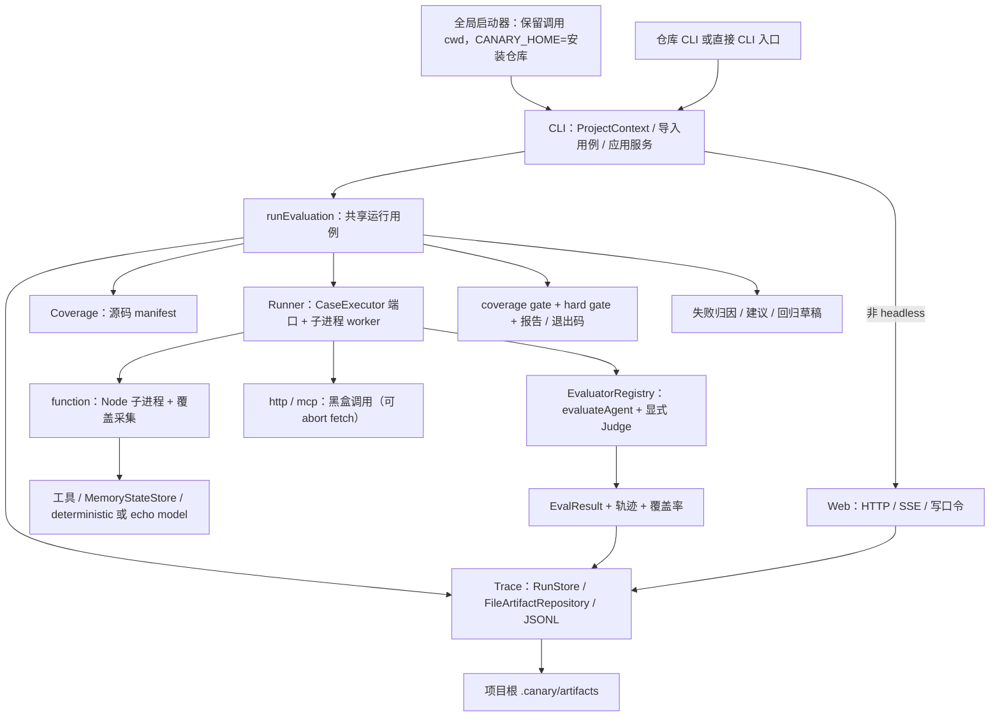

# 当前架构：以代码为准

> 范围：代码基线以 Git 工作区为准；R1 运行器隔离与恢复见 [R1 执行记录](../evidence/r1-execution-record.md)；R2 配置发现与 doctor 诊断见 [R2 执行记录](../evidence/r2-execution-record.md)；R3 artifact 证据链见 [R3 执行记录](../evidence/r3-execution-record.md)。这不是目标架构图。
> 逐项证据和风险见 [源码核对](../evidence/code-audit.md)，运行结果见 [验证记录](../evidence/validation-baseline.md)。

## 1. 实际主链路



CLI 在非 headless 时先分配 runId、监听并打印 UI 地址，再执行用例。`--headless` 不创建 HTTP 服务。`web.enabled: false` 同样跳过监听。

默认发现使用最近配置目录，同目录 `canary.project.json` 优先于 `canary.config.ts`，显式 `--config` 优先；错误配置不隐式回退。R4 新增 `canary.project` 配置分支：`discoverProject` 只读发现，`runProjectChecks` 按显式依赖串行编排 command/http/filesystem/process/docker/agent。项目运行使用独立 `checks` 结果、环境白名单与单调预算，复用 RunStore、checkpoint、R3 manifest；agent 子检查使用子 CLI 的 CI 契约并绑定 manifestHash。R5 普通项目模式通过 `runProjectSession` 在执行前创建回环页面，SSE 推送检查快照；重跑调用相同执行器并记录谱系。headless/CI 不创建页面，新增 resources 检查采样内存和磁盘。见 [R5 指南](../guides/r5-local-report.md)。详细边界见 [R4 使用说明](../guides/r4-project-checks.md)。

R10 在运行开始前由 `@canary/structure` 扫描目标项目，输出 `structure.json` 和可选 `structure-change.json` 并纳入 manifest。CLI、Web API 和 MCP 只读工具读取这份结构；覆盖文件先校验源文件哈希再关联节点。历史运行只使用当次封存的结构，不以当前工作树重建。具体格式与语言范围见 [R10 结构指南](../guides/project-structure.md)。
R11 将同一封存结构接入首页入口、二维地图和 CSS 透视三维分层视图。节点详情只显示已确认的静态关系和经哈希匹配的覆盖关联；源码片段先比对当前文件或历史 Git 对象的 SHA-256。交互与限制见 [R11 地图指南](../guides/architecture-map.md)。

## 2. 包的实际职责与耦合

| 位置                   | 已有职责                                                                                                                        | 尚未完成的目标                                                                |
| ---------------------- | ------------------------------------------------------------------------------------------------------------------------------- | ----------------------------------------------------------------------------- |
| `packages/core`        | 类型、FeatureRegistry、DSL、Zod、ProjectContext 契约；Experiment/Trial 已声明未接线                                             | 评估准入授权与发布仍待 H/S 系列                                               |
| `packages/runner`      | worker、CaseExecutor、timeout/cancel/budget、进程树清理、workspace/lock/checkpoint；R3 恢复谱系和可选 context 时钟/随机源       | 子进程不是安全沙箱；OS 级隔离和长跑验收边界保持                               |
| `packages/isolation`   | userspace preload、网络/路径守卫、Windows/POSIX 进程树适配与孤儿回收                                                            | 不是文件/网络/凭据访问控制                                                    |
| `packages/adapters`    | Function/HTTP/MCP Agent 包装；Mock/MCP stdio/MCP HTTP 工具；模型接口                                                            | Runner 不是统一调用 AgentAdapter registry；MCP 是简化协议实现                 |
| `packages/environment` | JSON 可克隆的内存状态、snapshot/restore、工具环境                                                                               | 不回滚文件、远程服务或真实世界副作用                                          |
| `packages/coverage`    | V8、源码映射、manifest、fragment、可选 Istanbul instrumentation、feature chain                                                  | 各 provider 精度不同；覆盖率不是语义质量或权限隔离证明                        |
| `packages/evaluators`  | 断言 dispatcher、EvaluatorRegistry、显式 Judge 注入、Metric/admission                                                           | 没有统计显著性；admission 默认 hold，不是自动发布                             |
| `packages/trace`       | JSONL v1、输出脱敏、原子持久化、artifact manifest/hash/history、校验、尾行恢复、历史清理、RunStore                              | SSE 游标不跨重启；无签名或外部可信锚                                          |
| `packages/structure`   | R10 节点、静态关系、未知关系、架构分层、Git 工作树变更及覆盖节点关联                                                            | 动态与跨语言调用、运行时拓扑仍未实现                                          |
| `packages/improvement` | trial 对账、holdout 标签/数据集、可序列化草稿、独立 admission                                                                   | 不修改 Agent；没有统计显著性和发布/回滚                                       |
| `packages/reporters`   | JSON / Markdown / JUnit / console                                                                                               | 不等于独立安全准入控制器                                                      |
| `packages/cli`         | ProjectContext、runEvaluation 应用服务；headless 不加载 Web；doctor 导入受信任配置做 schema/权限/根冲突诊断，不自动改写用户文件 | R5 页面已整合；R6 已有 Windows/Ubuntu 容器 Node 24/22 证据，macOS/Pi 等待补齐 |
| `apps/web`             | HTTP/SSE UI；写接口需要 token                                                                                                   | 不是完整审批控制面                                                            |

## 3. 当前可信边界

- 配置和用例通过动态 import 在 CLI 进程执行，`output.predicate` 等评估逻辑也不是隔离的纯数据；整个项目及其依赖需被用户信任。
- Function Agent 在子进程运行，具有继承的环境变量及宿主权限。每次运行有独立 tmp/work/env/port/lock，超时/取消/预算会终止进程树并写 checkpoint；这不等于文件/网络/凭据访问控制。
- HTTP/MCP Agent 只提供边界请求与响应，不能自动采集远端内部轨迹或 V8 coverage。
- `judge.score` 未配置必需 Provider 时失败；deterministic stub 不会把“输出存在”当成语义评分。HTTP Judge 需 `allowOutbound` 并在超时 abort。
- 完整 snapshot、trace、报告、coverage manifest、HTTP/SSE 和派生 artifact 走输出脱敏；覆盖率数值仍由原始执行计算。识别模式和已知敏感值的保护边界见 [R3 使用说明](../guides/r3-artifact-evidence.md)。
- 当前硬门禁是结果检查，不是前置工具权限拦截；预期 policy/loop 事件在负向测试中可被豁免，不可直接升级成生产安全政策。

## 4. R3 证据链

R3 在运行目录维护 `manifest.json` 和内容寻址的 manifest 历史，结束 trace 与资源清理后封存。CLI `verify`、artifact repository 和 Web 读取使用同一校验路径；旧格式返回 legacy，损坏结果拒绝继续读取或派生写入。恢复记录尾行截断的哈希及运行谱系。历史清理只在配置后通过 `prune --apply` 显式执行。

## 5. 当前 improvement 与未来自循环不是一回事

```text
已有：run → attribution → suggestion → accept/reject → verify（写草稿）
      → 人工提供 candidate entry → compare

目标：证据 → 候选 → 受控执行 → 独立验证 → 准入 → 授权应用
      → 后续运行实际加载 → 监测 / 回滚 → 下一轮有界实验
```

`verified` 是建议状态，不证明候选行为有效；`compare` 的 improve/keep/reject 不是发布许可。缺口由 [任务总表](../roadmap/README.md) 追踪。

## 6. R12 地图诊断

Web 的 `/api/structure` 在运行 manifest 核验后读取结构、覆盖和覆盖 manifest，再按源码哈希映射文件及 JS/TS 符号的行、函数和分支分母。父运行与 Agent 子运行分别保留测量来源，不把不同分母平均。普通命令的错误堆栈可以映射到已校验源码中的路径与行号；该路径不证明命令执行时的全部字节。页面的覆盖、失败和变更颜色模式使用不同图例，未采集、黑盒和哈希不一致显示未知。细节见[地图指南](../guides/architecture-map.md)与[R12 证据](../evidence/r12-execution.md)。

## 7. R13–R15 架构与 CI

`@canary/structure` 产出确定性的架构诊断和变更影响，CLI 在检查前生成选择计划，全部封存在本次 manifest 内。增量只有显式请求且输入范围足够时才省略检查；前置项重新执行，未知或全局配置变化回退全量。静态风险不自动改变现有门禁；省略项不计为通过。页面、历史 CLI 及有界 MCP 读取同一运行的结果，不复算旧记录。契约与边界见[架构与 CI 指南](../guides/architecture-ci.md)。
