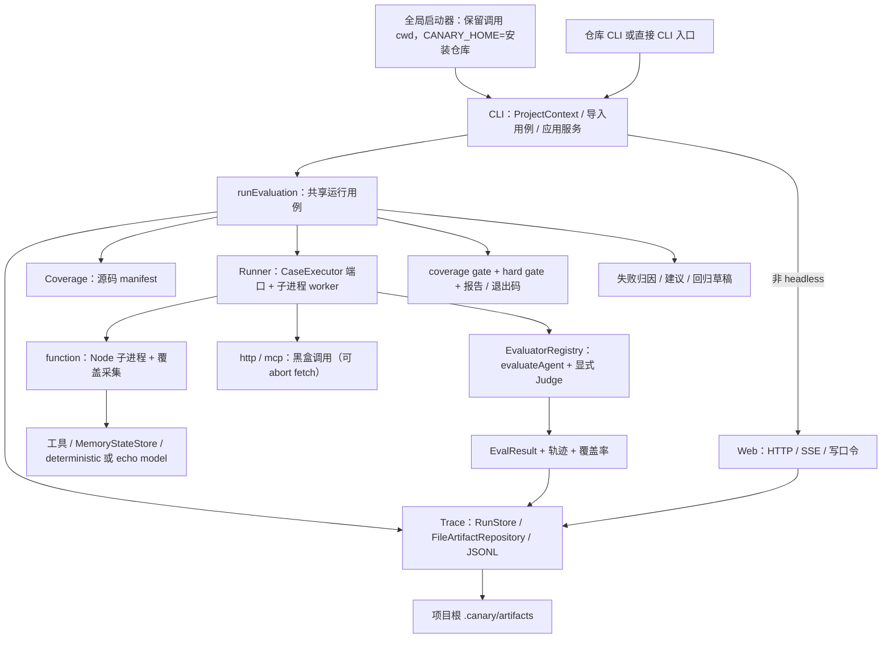

# 当前架构：以代码为准

> 范围：代码基线以 Git 工作区为准；R1 运行器隔离与恢复见 [R1 执行记录](../evidence/r1-execution-record.md)；R2 配置发现与 doctor 诊断见 [R2 执行记录](../evidence/r2-execution-record.md)。这不是目标架构图。
> 逐项证据和风险见 [源码核对](../evidence/code-audit.md)，运行结果见 [验证记录](../evidence/validation-baseline.md)。

## 1. 实际主链路



CLI 在非 headless 时先分配 runId、监听并打印 UI 地址，再执行用例。`--headless` 不创建 HTTP 服务。`web.enabled: false` 同样跳过监听。

## 2. 包的实际职责与耦合

| 位置                   | 已有职责                                                                                                                                                 | 尚未完成的目标                                                |
| ---------------------- | -------------------------------------------------------------------------------------------------------------------------------------------------------- | ------------------------------------------------------------- |
| `packages/core`        | 类型、FeatureRegistry、DSL、Zod、ProjectContext 契约；Experiment/Trial 已声明未接线                                                                      | 评估准入授权与发布仍待 H/S 系列                               |
| `packages/runner`      | worker 脚本拆出、CaseExecutor 端口、HTTP/MCP 传递 AbortSignal；统一 timeout/cancel/budget 终止、进程树清理、tmp/work/env/port/lock 隔离、checkpoint 恢复 | 子进程不是安全沙箱；OS 级隔离仍属 H-01；artifact 完整性属 R3  |
| `packages/isolation`   | userspace preload、网络/路径守卫、Windows/POSIX 进程树适配与孤儿回收                                                                                     | 不是文件/网络/凭据访问控制                                    |
| `packages/adapters`    | Function/HTTP/MCP Agent 包装；Mock/MCP stdio/MCP HTTP 工具；模型接口                                                                                     | Runner 不是统一调用 AgentAdapter registry；MCP 是简化协议实现 |
| `packages/environment` | JSON 可克隆的内存状态、snapshot/restore、工具环境                                                                                                        | 不回滚文件、远程服务或真实世界副作用                          |
| `packages/coverage`    | V8、源码映射、manifest、fragment、可选 Istanbul instrumentation、feature chain                                                                           | 各 provider 精度不同；覆盖率不是语义质量或权限隔离证明        |
| `packages/evaluators`  | 断言 dispatcher、EvaluatorRegistry、显式 Judge 注入、Metric/admission                                                                                    | 没有统计显著性；admission 默认 hold，不是自动发布             |
| `packages/trace`       | JSONL v1、异步 sink、统一脱敏、FileArtifactRepository、RunStore                                                                                          | SSE 游标不跨重启；不是云遥测                                  |
| `packages/improvement` | trial 对账、holdout 标签/数据集、可序列化草稿、独立 admission                                                                                            | 不修改 Agent；没有统计显著性和发布/回滚                       |
| `packages/reporters`   | JSON / Markdown / JUnit / console                                                                                                                        | 不等于独立安全准入控制器                                      |
| `packages/cli`         | ProjectContext、runEvaluation 应用服务；headless 不加载 Web；doctor 导入受信任配置做 schema/权限/根冲突诊断，不自动改写用户文件                          | Skill/硬进化仍待 S/H 系列；R4 全局多语言 `--ci` 未完成        |
| `apps/web`             | HTTP/SSE UI；写接口需要 token                                                                                                                            | 不是完整审批控制面                                            |

## 3. 当前可信边界

- 配置和用例通过动态 import 在 CLI 进程执行，`output.predicate` 等评估逻辑也不是隔离的纯数据；整个项目及其依赖需被用户信任。
- Function Agent 在子进程运行，具有继承的环境变量及宿主权限。每次运行有独立 tmp/work/env/port/lock，超时/取消/预算会终止进程树并写 checkpoint；这不等于文件/网络/凭据访问控制。
- HTTP/MCP Agent 只提供边界请求与响应，不能自动采集远端内部轨迹或 V8 coverage。
- `judge.score` 未配置必需 Provider 时失败；deterministic stub 不会把“输出存在”当成语义评分。HTTP Judge 需 `allowOutbound` 并在超时 abort。
- Trace JSONL、EvalResult 的 input/output、落盘 snapshot 走同一套脱敏。SSE 载荷仍可能含运行时字段；覆盖率产物仍可能含源码。
- 当前硬门禁是结果检查，不是前置工具权限拦截；预期 policy/loop 事件在负向测试中可被豁免，不可直接升级成生产安全政策。

## 4. 当前 improvement 与未来自循环不是一回事

```text
已有：run → attribution → suggestion → accept/reject → verify（写草稿）
      → 人工提供 candidate entry → compare

目标：证据 → 候选 → 受控执行 → 独立验证 → 准入 → 授权应用
      → 后续运行实际加载 → 监测 / 回滚 → 下一轮有界实验
```

`verified` 是建议状态，不证明候选行为有效；`compare` 的 improve/keep/reject 不是发布许可。缺口由 [任务总表](../roadmap/README.md) 追踪。
