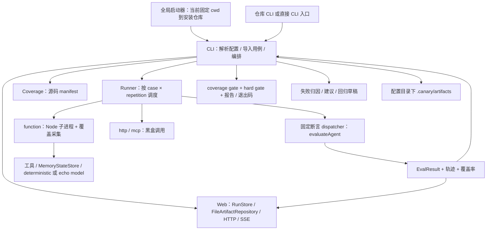

# 当前架构：以代码为准

> 范围：代码基线 `30f11cf4a303ab8616fb702bad8348bba4955466`；这不是目标架构图。
> 逐项证据和风险见 [源码核对](../evidence/code-audit.md)，运行结果见 [验证记录](../evidence/validation-baseline.md)。

## 1. 实际主链路



CLI 先启动 Web listener，再等待全部执行完成，最后打印地址并打开浏览器。`--headless` 也经历监听过程，完成后关闭；`web.enabled` 当前没有控制这一路径。不要用“实时 SSE 已存在”推导“用户启动时就自动看到实时页面”。

## 2. 包的实际职责与耦合

| 位置                   | 已有职责                                                                       | 尚未完成的目标                                                 |
| ---------------------- | ------------------------------------------------------------------------------ | -------------------------------------------------------------- |
| `packages/core`        | 类型、FeatureRegistry、DSL、Zod 配置/产物/协议校验                             | 尚无 RFC 所描述的 domain/ports 拆分和已接线 Experiment 模型    |
| `packages/runner`      | 内嵌 worker 脚本、Node 子进程、覆盖率、事件、断言、HTTP/MCP 分支、并发工具函数 | 尚未统一依赖注入 ports；子进程不是安全沙箱；跨适配器取消不一致 |
| `packages/adapters`    | Function/HTTP/MCP Agent 包装；Mock/MCP stdio/MCP HTTP 工具；模型接口           | Runner 不是统一调用 AgentAdapter registry；MCP 是简化协议实现  |
| `packages/environment` | JSON 可克隆的内存状态、snapshot/restore、工具环境                              | 不回滚文件、远程服务或真实世界副作用                           |
| `packages/coverage`    | V8、源码映射、manifest、fragment、可选 Istanbul instrumentation、feature chain | 各 provider 精度不同；覆盖率不是语义质量或权限隔离证明         |
| `packages/evaluators`  | 断言 dispatcher、JudgeProvider/HTTP 与 deterministic 实现、失败归因、门禁      | 没有通用 evaluator registry；CLI/Runner 未注入真实 Judge       |
| `packages/trace`       | 事件缓存、查询、同步 JSONL append 和启发式脱敏                                 | 未统一所有输出的脱敏、异步 sink、可信证据与跨重启事件序列      |
| `packages/improvement` | 建议状态机、回归草稿、两轮比较                                                 | 不修改 Agent；没有完整性/统计准入、候选生成、发布/回滚         |
| `packages/reporters`   | JSON / Markdown / JUnit / console                                              | 不等于独立安全准入控制器                                       |
| `packages/cli`         | 配置和用例导入、运行、落盘、报告、历史与改进命令                               | CLI 仍持有应用与持久化逻辑，且依赖 Web 内的存储类型            |
| `apps/web`             | HTTP、SSE、UI、RunStore、artifact repository、建议状态写入与 compare           | 未形成与 CLI 无关的共享应用服务或已授权的写操作控制面          |

## 3. 当前可信边界

- 配置和用例通过动态 import 在 CLI 进程执行，`output.predicate` 等评估逻辑也不是隔离的纯数据；整个项目及其依赖需被用户信任。
- Function Agent 在子进程运行，具有继承的环境变量及宿主权限。已有超时、取消、进程树终止，不等于文件/网络/凭据访问控制。
- HTTP/MCP Agent 只提供边界请求与响应，不能自动采集远端内部轨迹或 V8 coverage。
- `judge.score` 在未传入 Judge 时使用 deterministic provider，默认主要检查输出存在；接口支持真实 Judge 不等于默认流程已做语义判断。
- Trace JSONL 与结果轨迹有脱敏调用，但 output/input、聚合 events、Web/SSE、源码覆盖产物不能宣称已统一脱敏。
- 当前硬门禁是结果检查，不是前置工具权限拦截；预期 policy/loop 事件在负向测试中可被豁免，不可直接升级成生产安全政策。

## 4. 当前 improvement 与未来自循环不是一回事

```text
已有：run → attribution → suggestion → accept/reject → verify（写草稿）
      → 人工提供 candidate entry → compare

目标：证据 → 候选 → 受控执行 → 独立验证 → 准入 → 授权应用
      → 后续运行实际加载 → 监测 / 回滚 → 下一轮有界实验
```

`verified` 是建议状态，不证明候选行为有效；`compare` 的 improve/keep/reject 不是发布许可。缺口由 [任务总表](../roadmap/README.md) 追踪。
