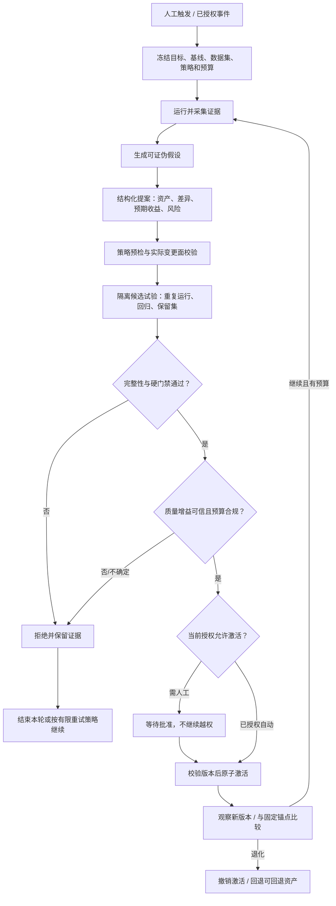

# 理想 Agent 自循环：有边界、可验证、可回退

> 状态：后续目标，不是现有实现。当前项目只有运行、建议、草稿和比较等基础能力，没有完整的自动进化控制器。本轮只重构文档。

## 1. 定义：进化的是可控资产，不是宣称模型权重变聪明

Canary 使 Agent 通过证据改善下一次执行：收集失败 → 提出有限变更 → 独立验证 → 按授权发布 → 再次观察。默认改善受管理的经验、任务 Prompt、Skill 策略；用户另外授权后可改善自己的 Agent/项目代码。

这里不包括基础模型权重训练，也不承诺任意任务单调提升。一次通过只能说明**在冻结的评估分布、预算和环境上满足准入条件**。长期稳步发展依靠固定锚点、回归集、保留集、线上观察和撤销机制，而不是依靠模型自称“已修复”。

安装 Canary 只安装工具。自动循环必须显式启用，还必须有实际执行器：正在运行且接受该任务的宿主 Agent、用户配置的模型 API 或本地模型。没有执行器时进入等待，不能凭空复用关闭的 IDE 会话。

## 2. 不变的职责边界

| 角色            | 可以做                                     | 不可以做                                  |
| --------------- | ------------------------------------------ | ----------------------------------------- |
| 用户/项目所有者 | 定义目标、预算、授权、风险例外；撤销或回滚 | 不能用开源标签代替目标仓库写权限          |
| 提案 Agent      | 阅读授权证据、提交假设和变更清单           | 修改保护规则、批准自己、接触隐藏答案      |
| Canary 控制器   | 按固定状态机调度、记账、恢复、停止         | 根据模型叙述跳过门禁或扩大权限            |
| 独立评估器      | 执行冻结测试、质量评价、统计比较           | 为候选修改标准、把缺测算成功              |
| 受信应用器      | 校验授权和版本，应用被验证的精确产物       | 重新让 LLM 生成另一份“等效”代码后直接发布 |

逻辑角色隔离不自动等于安全隔离。若宿主仍可直接写项目，或 Agent 与控制器共享可写策略目录，以上只是约定。工程上必须限制真实文件、进程、网络及凭证能力；详细规则见[进化策略](evolution-policy.md)。

## 3. 自循环状态机

任一阶段遇到撤销、预算耗尽、不可恢复错误、无执行器、证据污染或状态冲突，应停止/等待并说明原因。拒绝不是继续无限试验的许可证。每次触发、候选数、运行时长、Token/费用、工具调用和总轮数都有上限。

## 4. 一个候选必须携带的最小证据

这是未来数据契约，不是现有 API：

- `goal`：成功标准、非目标、固定质量目标与安全不变量。
- `baseline`：项目/资产版本、有效配置、数据集与评估器版本、运行环境和模型标识。
- `proposal`：问题证据、因果假设、变更类型、允许路径、实际 diff/内容哈希、预期收益和副作用。
- `experiment`：独立的 candidate ID、试验矩阵、case × repetition 完整账本、随机性配置、超时与预算。
- `decision`：硬门禁、质量/成本/延迟比较、不确定性、缺测原因、评估证据、准入策略版本。
- `activation`：授权主体、授权有效期、被批准的哈希、被替换的基线、实际应用结果、撤销引用。

任何结果都必须能够追溯到“哪份代码/经验在什么条件下跑了哪些用例”。未知指标不当成 0，缺少结果不能过滤后宣称改善。配置、模型或数据集发生不可比变更时，新建实验或明确标记，不能沿用旧结论。

## 5. 软进化如何真正生效

软进化只写 Canary 管理且版本化的记忆/任务策略，不写项目源码或宿主安全指令。每条经验保存：来源 run/case、适用范围、反例、验证记录、内容哈希、优先级、失效条件和预算成本。

加载器在**下一次执行前**按任务相关性检索少量经验，处理冲突、过期和重复，并在运行清单中记录实际加载的版本。未被加载的“经验文件”不算完成进化。工具返回、网页和 Trace 是不可信数据，不能直接提升为系统指令；候选记忆同样必须经过注入检测和试验。

软进化也能造成错误建议、信息泄漏、成本膨胀，因此也需要审批/授权、验证和回滚。不能因为“不改源码”就免除门禁。

## 6. 硬进化如何自动改自己的项目

仅用户明确启用硬模式，并给予具体仓库/路径/动作授权，才允许候选修改代码。候选工作区与真实运行隔离；工作树/分支本身不是沙箱。Agent 仅输出补丁，独立应用器在所有门禁通过后按授权应用**同一份验证过的内容**。

应用前重新检查授权未撤销、策略未改变、基线未漂移和用户文件未发生冲突。通过 compare-and-swap 或等价版本检查保证不覆盖用户新修改。自动本地应用、Git 提交、远端 push、创建 PR、合并和部署应是分别授权的动作；硬模式并不一次性授予它们。

撤销硬模式立即禁止新写任务和待应用补丁；已激活版本是否回退由显式回滚策略决定。文件版本可回退不代表外部 API、邮件、数据库或真实订单能撤销，因此候选执行默认禁用真实外部副作用。

## 7. 防止“越训越会刷分”

- 独立保护评估器、策略、预算、保留集和审批记录，提案方不能写入。
- 开发集用于诊断；受保护保留集用于准入，返回必要摘要而非隐藏答案。限制反复探测并定期轮换。
- 修复已知失败前保存原始输入及**完整断言参数**，草稿由人/受信程序确认，不能退化成 `output.exists`。
- 重复试验按 case 和 trial 对齐；预先规定统计/非劣界限，处理波动、超时、退出码、缺失和不可用指标。
- 同时比较上一活动版和固定锚点，阻止多次“小幅可接受退化”累积。
- 独立 Judge 不等于换一个聊天窗口；不同上下文/模型可以降低相关性，但必须结合确定性检查与实际结果。

## 8. 持续控制器与看板

控制器保存可恢复状态、租约/锁、幂等键和费用账本，同一项目不并发应用冲突候选。断电/进程退出后恢复不能重复扣费或重复应用。取消应传递到子进程、HTTP/MCP/模型请求；无法终止的外部请求必须显式计入风险和预算。

Dashboard 展示基线/候选/活动版本谱系、失败证据、准入依据、加载经验、授权范围、预算余额、停止原因、审批和回滚记录。默认只读；具备修改效果的按钮走同一受信控制面。

## 9. 完成目标的验收场景

1. 不配模型，仍能运行确定性评估、查看 Dashboard；缺少必需 Judge 时拒绝自动准入。
2. 软模式从可复现失败生成经验，经独立回归验证后激活，下一次确实加载且能回退；项目源码哈希不变。
3. 提案试图改保护测试、读密钥、越界写文件、泄漏隐藏数据或无限重试时，被技术边界阻断并留证。
4. 硬模式在授权路径自动修复已知缺陷，应用精确候选；撤销、用户并发修改或任一门禁失败时不应用。
5. 模型关闭、服务崩溃、费用超限和网络超时时，能确定地停止/恢复，不重复发布。
6. 长期指标在固定锚点上可核查；证据不足时承认“不确定”，不声称普遍变强。

实施顺序与验收细分见[任务总表](../roadmap/README.md)；研究依据和适用限制见[资料综述](../research/agent-evolution.md)。
