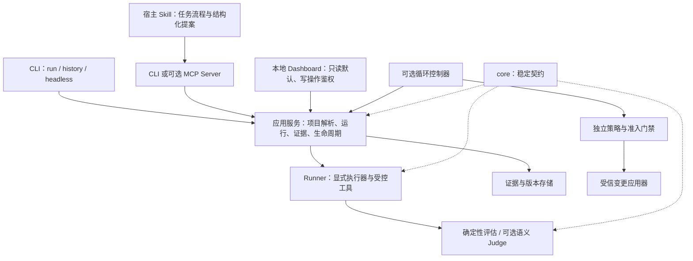

# 产品目标架构：本地评估优先，受控进化可选

> 状态：未来目标，未在本轮实现。替代原 `ARCHITECTURE-OPTIMIZATION-TARGET.md`。当前事实见[当前架构](../current/architecture.md)。

## 产品承诺与边界

用户通过一条命令安装，在**目标项目根目录**执行 `canary run`，打开仅本机可访问的 Dashboard，查看断言、工具行为、状态差异、覆盖率及证据。基础评估不需要 LLM、Key 或云服务。

这是一项目标，不是对当前安装流程的描述：当前全局安装脚本下载并构建仓库，启动器会改变工作目录；配置仍需存在，不能自动理解任何未知 Agent。安装成功不意味着自动拦截宿主 Agent 的所有操作。

第二入口是宿主 Agent 的 Canary Skill。用户通过该宿主实际支持的命令/技能选择方式触发，由 Skill 组织分析与调用。`/canary` 是产品交互意图，不承诺所有 Codex、Claude Code、Cursor 版本具有同样语法。

## 目标组件

`@canary/core` 应是契约层，不是容纳所有执行、服务、存储和模型调用的巨型引擎。CLI/Web/MCP 共用应用服务；CLI 不应继续依赖 Web 的实现类才能运行。优先渐进拆分，保留现有入口、产物兼容和测试。

## 两个入口：Skill 优先，MCP 按需要补充

| 能力                               | Skill                              | MCP                               |
| ---------------------------------- | ---------------------------------- | --------------------------------- |
| 教宿主如何执行 Canary 工作流       | 适合，包含步骤、输出格式和边界说明 | 不是工作流说明的替代品            |
| 调用评估、读取证据、提交结构化提案 | 可先调用 CLI                       | 适合提供有类型、可审计的工具接口  |
| 获得宿主模型推理                   | 宿主执行 Skill 时参与分析          | 协议本身不等于获得模型或凭证      |
| 强制限制宿主所有文件/网络操作      | 不能                               | 单独使用也不能                    |
| 首阶段取舍                         | 先验证一个宿主 + CLI 的完整体验    | 多宿主/结构化服务有明确需求后再做 |

MCP 的角色也要分清：当前项目有调用外部 MCP Agent/Tool 的**客户端适配器**；向宿主暴露 Canary 工具的 **Canary MCP Server** 是另一项待开发能力。

不要尝试读取 IDE 私有凭证、假设订阅可作 API Key 或“自动识别全部上下文”。仅使用用户授权的上下文、宿主支持的能力或显式配置的 Provider。MCP 协议须按支持版本实现，不能把旧版初始化流程泛化到所有版本，详见[研究说明](../research/agent-evolution.md)。

## 评估分层而不是固定 70% / 30%

1. **硬门禁**：完整性、安全、授权、状态不变量、必需测试。失败不允许被语义高分抵消。
2. **确定性质量指标**：断言、Schema、工具参数和路径、可验证状态。覆盖率仅在采集有效、分母可比时比较。
3. **可选语义评估**：明确 rubric、Provider、模型版本、置信度、成本、超时和数据外发策略。
4. **业务质量决策**：只在硬门禁通过后按预先固定的目标比较；不预设统一权重。

Judge 来源由用户明确选择：宿主结构化评价、显式 API Provider 或主动启用的本地模型。不得偷偷读取凭证、探测并启动 Ollama、下载模型或付费请求。宿主评价如果不满足独立验证要求，只能作为提案证据，不能单独批准自身变更。

无可用 Judge 时：可选维度显示 `skipped/unavailable`；**必需维度阻断准入**，不得算通过或填 0。当前 `judge.score` 默认确定性 Provider 会对存在的输出给出高分，尚未达到此目标，见[评估任务](../roadmap/02-evaluation-integrity.md)。

## 安装、端口与数据

- 单命令安装的发布渠道、包名和平台矩阵待验证，不在这里宣布已发布 npm 包或独立二进制。
- 分离调用目录、项目根、配置根、安装根、产物根；统一所有命令的项目选择。未知项目给出引导，不擅自执行任意代码。
- 先发布监听地址和运行 ID，再执行用例；headless 不监听、不打开浏览器。
- 本地服务默认 loopback；写 API 必须鉴权并校验来源/目标项目，不能把 CORS 当作授权。
- 默认本地存储；外部观测导出、模型外发和自动循环均显式启用。输入/输出/Trace/报告/UI 使用一致脱敏策略。

## 演进顺序

先修复项目入口和评估可信度，再做 Skill、软进化和隔离控制，最后开放硬进化与持续循环。实施列表只有[任务目录](../roadmap/README.md)维护；本文不提供可直接启用的未来配置。
